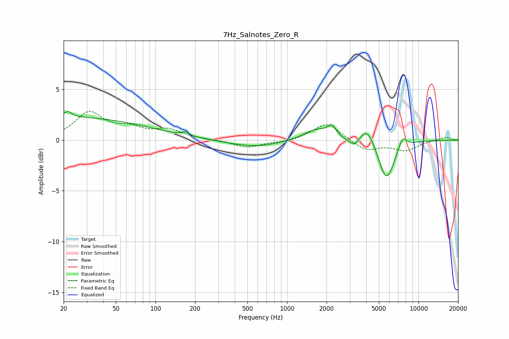

# 7Hz_Salnotes_Zero_R
See [usage instructions](https://github.com/jaakkopasanen/AutoEq#usage) for more options and info.

### Parametric EQs
Apply preamp of -2.9 dB when using parametric equalizer.

|   # | Type    |   Fc (Hz) |    Q |   Gain (dB) |
|-----|---------|-----------|------|-------------|
|   1 | Peaking |        20 | 0.2  |         2.3 |
|   2 | Peaking |        22 | 5.04 |         0.5 |
|   3 | Peaking |       169 | 5.99 |         0.4 |
|   4 | Peaking |       564 | 0.74 |        -0.7 |
|   5 | Peaking |      1684 | 1.46 |         1.1 |
|   6 | Peaking |      2195 | 4.6  |         1   |
|   7 | Peaking |      3265 | 3.01 |        -1   |
|   8 | Peaking |      4045 | 2.32 |         1.9 |
|   9 | Peaking |      5683 | 2.27 |        -4.1 |
|  10 | Peaking |      7569 | 4.6  |         1.1 |

### Fixed Band EQs
When using fixed band (also called graphic) equalizer, apply preamp of **-2.9 dB** (if available) and set gains manually with these parameters.

|   # | Type    |   Fc (Hz) |    Q |   Gain (dB) |
|-----|---------|-----------|------|-------------|
|   1 | Peaking |        31 | 1.41 |         2.6 |
|   2 | Peaking |        62 | 1.41 |         1   |
|   3 | Peaking |       125 | 1.41 |         0.9 |
|   4 | Peaking |       250 | 1.41 |         0   |
|   5 | Peaking |       500 | 1.41 |        -0.7 |
|   6 | Peaking |      1000 | 1.41 |        -0.2 |
|   7 | Peaking |      2000 | 1.41 |         1.8 |
|   8 | Peaking |      4000 | 1.41 |        -1   |
|   9 | Peaking |      8000 | 1.41 |        -1   |
|  10 | Peaking |     16000 | 1.41 |         0.3 |

### Graphs

