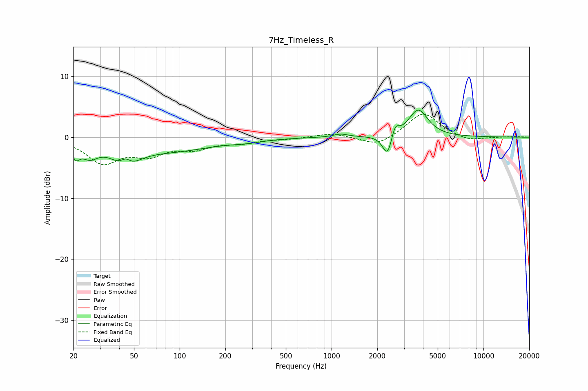

# 7Hz_Timeless_R
See [usage instructions](https://github.com/jaakkopasanen/AutoEq#usage) for more options and info.

### Parametric EQs
Apply preamp of -4.5 dB when using parametric equalizer.

|   # | Type    |   Fc (Hz) |    Q |   Gain (dB) |
|-----|---------|-----------|------|-------------|
|   1 | Peaking |        21 | 5.4  |        -2.1 |
|   2 | Peaking |        26 | 2.63 |        -2.2 |
|   3 | Peaking |        44 | 1.65 |        -3.7 |
|   4 | Peaking |        44 | 4.32 |         1.5 |
|   5 | Peaking |        91 | 0.54 |        -2   |
|   6 | Peaking |       279 | 1.33 |        -0.4 |
|   7 | Peaking |      1150 | 3    |         0.5 |
|   8 | Peaking |      2336 | 4.44 |        -3.7 |
|   9 | Peaking |      2617 | 6    |         2.1 |
|  10 | Peaking |      3720 | 2.23 |         4.5 |

### Fixed Band EQs
When using fixed band (also called graphic) equalizer, apply preamp of **-3.9 dB** (if available) and set gains manually with these parameters.

|   # | Type    |   Fc (Hz) |    Q |   Gain (dB) |
|-----|---------|-----------|------|-------------|
|   1 | Peaking |        31 | 1.41 |        -4   |
|   2 | Peaking |        62 | 1.41 |        -2.5 |
|   3 | Peaking |       125 | 1.41 |        -1.6 |
|   4 | Peaking |       250 | 1.41 |        -0.8 |
|   5 | Peaking |       500 | 1.41 |        -0.3 |
|   6 | Peaking |      1000 | 1.41 |         0.7 |
|   7 | Peaking |      2000 | 1.41 |        -1.6 |
|   8 | Peaking |      4000 | 1.41 |         4.1 |
|   9 | Peaking |      8000 | 1.41 |        -0.8 |
|  10 | Peaking |     16000 | 1.41 |         0.1 |

### Graphs

