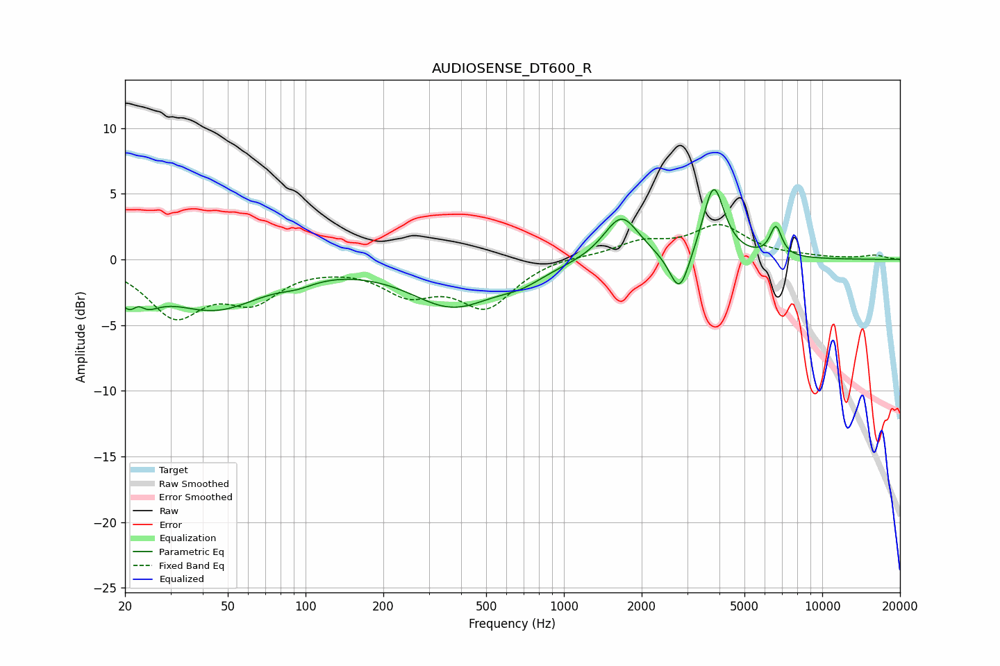

# AUDIOSENSE_DT600_R
See [usage instructions](https://github.com/jaakkopasanen/AutoEq#usage) for more options and info.

### Parametric EQs
Apply preamp of -5.4 dB when using parametric equalizer.

|   # | Type    |   Fc (Hz) |    Q |   Gain (dB) |
|-----|---------|-----------|------|-------------|
|   1 | Peaking |        22 | 2.42 |        -3.6 |
|   2 | Peaking |        22 | 5.04 |         1.6 |
|   3 | Peaking |        44 | 0.74 |        -3.6 |
|   4 | Peaking |        93 | 2.15 |        -0.5 |
|   5 | Peaking |       371 | 0.86 |        -3.4 |
|   6 | Peaking |       686 | 1.56 |        -0.9 |
|   7 | Peaking |      1669 | 2.08 |         3.4 |
|   8 | Peaking |      2803 | 3.67 |        -3.3 |
|   9 | Peaking |      3797 | 3.42 |         5.6 |
|  10 | Peaking |      6617 | 6    |         2.3 |

### Fixed Band EQs
When using fixed band (also called graphic) equalizer, apply preamp of **-2.8 dB** (if available) and set gains manually with these parameters.

|   # | Type    |   Fc (Hz) |    Q |   Gain (dB) |
|-----|---------|-----------|------|-------------|
|   1 | Peaking |        31 | 1.41 |        -4   |
|   2 | Peaking |        62 | 1.41 |        -2.7 |
|   3 | Peaking |       125 | 1.41 |        -0.2 |
|   4 | Peaking |       250 | 1.41 |        -2.3 |
|   5 | Peaking |       500 | 1.41 |        -3.4 |
|   6 | Peaking |      1000 | 1.41 |         0.3 |
|   7 | Peaking |      2000 | 1.41 |         1.2 |
|   8 | Peaking |      4000 | 1.41 |         2.4 |
|   9 | Peaking |      8000 | 1.41 |         0.1 |
|  10 | Peaking |     16000 | 1.41 |         0.3 |

### Graphs

