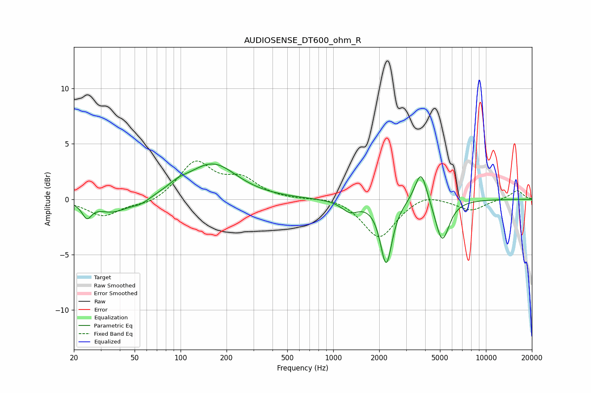

# AUDIOSENSE_DT600_ohm_R
See [usage instructions](https://github.com/jaakkopasanen/AutoEq#usage) for more options and info.

### Parametric EQs
Apply preamp of -3.3 dB when using parametric equalizer.

|   # | Type    |   Fc (Hz) |    Q |   Gain (dB) |
|-----|---------|-----------|------|-------------|
|   1 | Peaking |        24 | 4.69 |        -1.3 |
|   2 | Peaking |        36 | 1.38 |        -1.2 |
|   3 | Peaking |        55 | 2.33 |        -0.5 |
|   4 | Peaking |        96 | 2.13 |         0.5 |
|   5 | Peaking |       155 | 1.52 |        -0.2 |
|   6 | Peaking |       161 | 0.92 |         3.3 |
|   7 | Peaking |      1288 | 2.58 |        -1   |
|   8 | Peaking |      2223 | 3.72 |        -5.7 |
|   9 | Peaking |      3758 | 3.44 |         3.1 |
|  10 | Peaking |      5168 | 3.04 |        -3.9 |

### Fixed Band EQs
When using fixed band (also called graphic) equalizer, apply preamp of **-3.5 dB** (if available) and set gains manually with these parameters.

|   # | Type    |   Fc (Hz) |    Q |   Gain (dB) |
|-----|---------|-----------|------|-------------|
|   1 | Peaking |        31 | 1.41 |        -1.5 |
|   2 | Peaking |        62 | 1.41 |        -0.5 |
|   3 | Peaking |       125 | 1.41 |         3.3 |
|   4 | Peaking |       250 | 1.41 |         1.6 |
|   5 | Peaking |       500 | 1.41 |        -0   |
|   6 | Peaking |      1000 | 1.41 |         0.3 |
|   7 | Peaking |      2000 | 1.41 |        -3.5 |
|   8 | Peaking |      4000 | 1.41 |         0.7 |
|   9 | Peaking |      8000 | 1.41 |        -1   |
|  10 | Peaking |     16000 | 1.41 |         0.8 |

### Graphs

