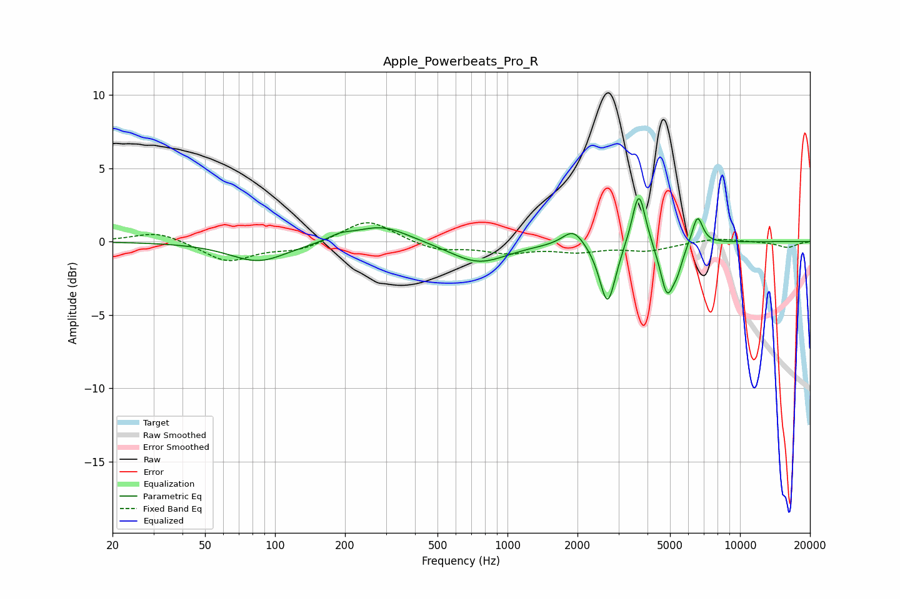

# Apple_Powerbeats_Pro_R
See [usage instructions](https://github.com/jaakkopasanen/AutoEq#usage) for more options and info.

### Parametric EQs
Apply preamp of -3.0 dB when using parametric equalizer.

|   # | Type    |   Fc (Hz) |    Q |   Gain (dB) |
|-----|---------|-----------|------|-------------|
|   1 | Peaking |        85 | 1.14 |        -1.4 |
|   2 | Peaking |       190 | 2.89 |         0.3 |
|   3 | Peaking |       286 | 1.18 |         1.2 |
|   4 | Peaking |       752 | 1.15 |        -1.5 |
|   5 | Peaking |      1919 | 3.13 |         1.1 |
|   6 | Peaking |      2694 | 4.12 |        -4.3 |
|   7 | Peaking |      3672 | 4.93 |         3.9 |
|   8 | Peaking |      4856 | 4.63 |        -3.5 |
|   9 | Peaking |      5385 | 6    |        -1.1 |
|  10 | Peaking |      6560 | 5.98 |         2   |

### Fixed Band EQs
When using fixed band (also called graphic) equalizer, apply preamp of **-1.4 dB** (if available) and set gains manually with these parameters.

|   # | Type    |   Fc (Hz) |    Q |   Gain (dB) |
|-----|---------|-----------|------|-------------|
|   1 | Peaking |        31 | 1.41 |         0.7 |
|   2 | Peaking |        62 | 1.41 |        -1.4 |
|   3 | Peaking |       125 | 1.41 |        -0.6 |
|   4 | Peaking |       250 | 1.41 |         1.6 |
|   5 | Peaking |       500 | 1.41 |        -0.6 |
|   6 | Peaking |      1000 | 1.41 |        -0.7 |
|   7 | Peaking |      2000 | 1.41 |        -0.6 |
|   8 | Peaking |      4000 | 1.41 |        -0.6 |
|   9 | Peaking |      8000 | 1.41 |         0.3 |
|  10 | Peaking |     16000 | 1.41 |        -0.4 |

### Graphs

