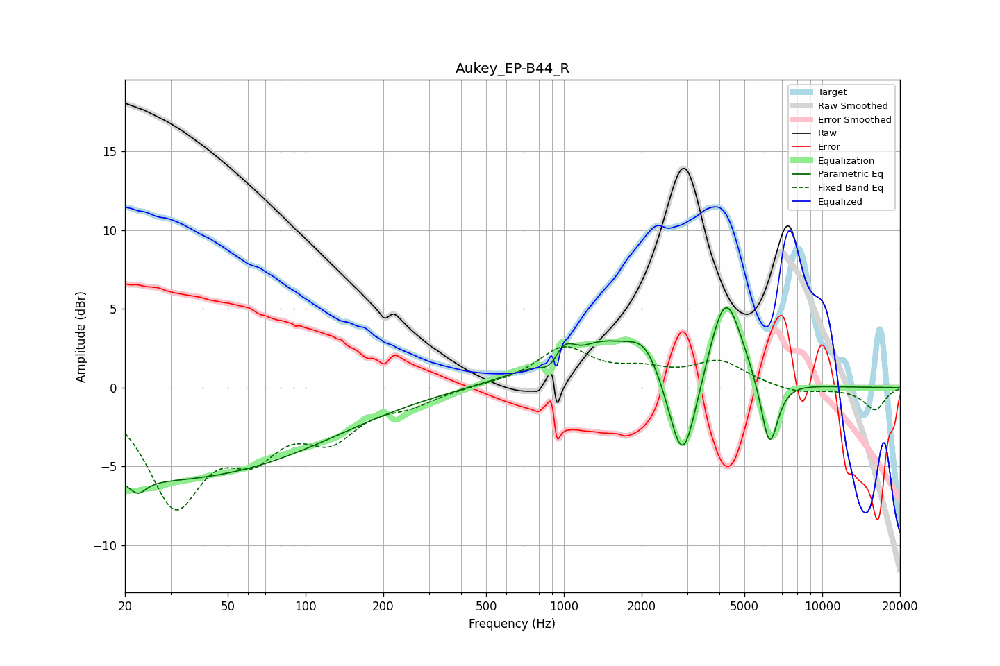

# Aukey_EP-B44_R
See [usage instructions](https://github.com/jaakkopasanen/AutoEq#usage) for more options and info.

### Parametric EQs
Apply preamp of -5.2 dB when using parametric equalizer.

|   # | Type    |   Fc (Hz) |    Q |   Gain (dB) |
|-----|---------|-----------|------|-------------|
|   1 | Peaking |        22 | 4.72 |        -0.8 |
|   2 | Peaking |        25 | 0.18 |        -5.9 |
|   3 | Peaking |       897 | 3.32 |        -1.2 |
|   4 | Peaking |       989 | 3.66 |         1.2 |
|   5 | Peaking |      1177 | 3.47 |        -0.3 |
|   6 | Peaking |      1344 | 0.71 |         3   |
|   7 | Peaking |      2067 | 2.35 |         1.6 |
|   8 | Peaking |      2884 | 2.54 |        -6.7 |
|   9 | Peaking |      4225 | 2.17 |         6.1 |
|  10 | Peaking |      6249 | 4.07 |        -4.6 |

### Fixed Band EQs
When using fixed band (also called graphic) equalizer, apply preamp of **-2.7 dB** (if available) and set gains manually with these parameters.

|   # | Type    |   Fc (Hz) |    Q |   Gain (dB) |
|-----|---------|-----------|------|-------------|
|   1 | Peaking |        31 | 1.41 |        -7   |
|   2 | Peaking |        62 | 1.41 |        -3.3 |
|   3 | Peaking |       125 | 1.41 |        -2.7 |
|   4 | Peaking |       250 | 1.41 |        -0.8 |
|   5 | Peaking |       500 | 1.41 |         0.1 |
|   6 | Peaking |      1000 | 1.41 |         2.4 |
|   7 | Peaking |      2000 | 1.41 |         0.9 |
|   8 | Peaking |      4000 | 1.41 |         1.6 |
|   9 | Peaking |      8000 | 1.41 |        -0.4 |
|  10 | Peaking |     16000 | 1.41 |        -1.4 |

### Graphs

