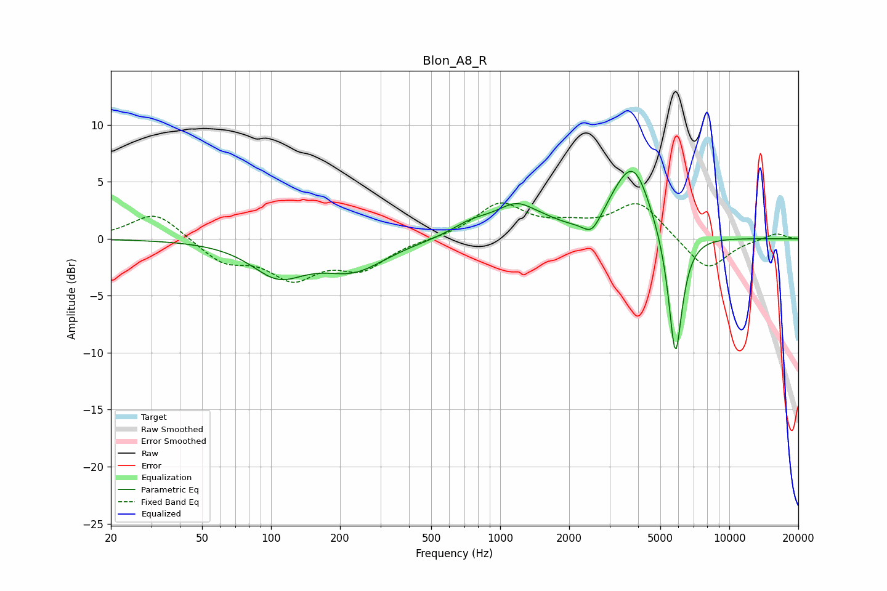

# Blon_A8_R
See [usage instructions](https://github.com/jaakkopasanen/AutoEq#usage) for more options and info.

### Parametric EQs
Apply preamp of -6.0 dB when using parametric equalizer.

|   # | Type    |   Fc (Hz) |    Q |   Gain (dB) |
|-----|---------|-----------|------|-------------|
|   1 | Peaking |       107 | 1.22 |        -2.9 |
|   2 | Peaking |       229 | 0.99 |        -2.5 |
|   3 | Peaking |       746 | 1.6  |         1   |
|   4 | Peaking |      1235 | 1.36 |         3.2 |
|   5 | Peaking |      1345 | 2.4  |        -0.5 |
|   6 | Peaking |      2509 | 3.92 |        -1.2 |
|   7 | Peaking |      2909 | 1.24 |        -0.7 |
|   8 | Peaking |      3261 | 1.94 |         1.8 |
|   9 | Peaking |      3867 | 1.82 |         5.7 |
|  10 | Peaking |      5816 | 4.48 |       -11.5 |

### Fixed Band EQs
When using fixed band (also called graphic) equalizer, apply preamp of **-3.2 dB** (if available) and set gains manually with these parameters.

|   # | Type    |   Fc (Hz) |    Q |   Gain (dB) |
|-----|---------|-----------|------|-------------|
|   1 | Peaking |        31 | 1.41 |         2.4 |
|   2 | Peaking |        62 | 1.41 |        -2   |
|   3 | Peaking |       125 | 1.41 |        -3.1 |
|   4 | Peaking |       250 | 1.41 |        -2.4 |
|   5 | Peaking |       500 | 1.41 |        -0   |
|   6 | Peaking |      1000 | 1.41 |         3   |
|   7 | Peaking |      2000 | 1.41 |         0.9 |
|   8 | Peaking |      4000 | 1.41 |         3.2 |
|   9 | Peaking |      8000 | 1.41 |        -2.9 |
|  10 | Peaking |     16000 | 1.41 |         0.5 |

### Graphs

