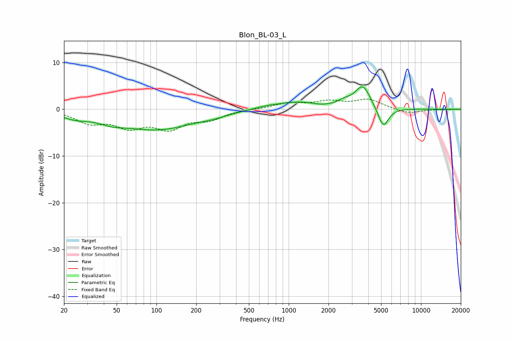

# Blon_BL-03_L
See [usage instructions](https://github.com/jaakkopasanen/AutoEq#usage) for more options and info.

### Parametric EQs
Apply preamp of -4.9 dB when using parametric equalizer.

|   # | Type    |   Fc (Hz) |    Q |   Gain (dB) |
|-----|---------|-----------|------|-------------|
|   1 | Peaking |        24 | 1.36 |        -1.3 |
|   2 | Peaking |        46 | 1.41 |        -1.1 |
|   3 | Peaking |       102 | 0.5  |        -4.2 |
|   4 | Peaking |       272 | 1.5  |        -0.5 |
|   5 | Peaking |       670 | 1.78 |         0.3 |
|   6 | Peaking |      1185 | 0.78 |         1.6 |
|   7 | Peaking |      1756 | 2.11 |        -0.4 |
|   8 | Peaking |      2642 | 3.04 |         0.8 |
|   9 | Peaking |      3632 | 2.37 |         4.9 |
|  10 | Peaking |      5186 | 3.42 |        -4.5 |

### Fixed Band EQs
When using fixed band (also called graphic) equalizer, apply preamp of **-2.3 dB** (if available) and set gains manually with these parameters.

|   # | Type    |   Fc (Hz) |    Q |   Gain (dB) |
|-----|---------|-----------|------|-------------|
|   1 | Peaking |        31 | 1.41 |        -2.6 |
|   2 | Peaking |        62 | 1.41 |        -3.3 |
|   3 | Peaking |       125 | 1.41 |        -3.7 |
|   4 | Peaking |       250 | 1.41 |        -1.9 |
|   5 | Peaking |       500 | 1.41 |         0.1 |
|   6 | Peaking |      1000 | 1.41 |         1.2 |
|   7 | Peaking |      2000 | 1.41 |         1.5 |
|   8 | Peaking |      4000 | 1.41 |         2   |
|   9 | Peaking |      8000 | 1.41 |        -1   |
|  10 | Peaking |     16000 | 1.41 |        -0.1 |

### Graphs

