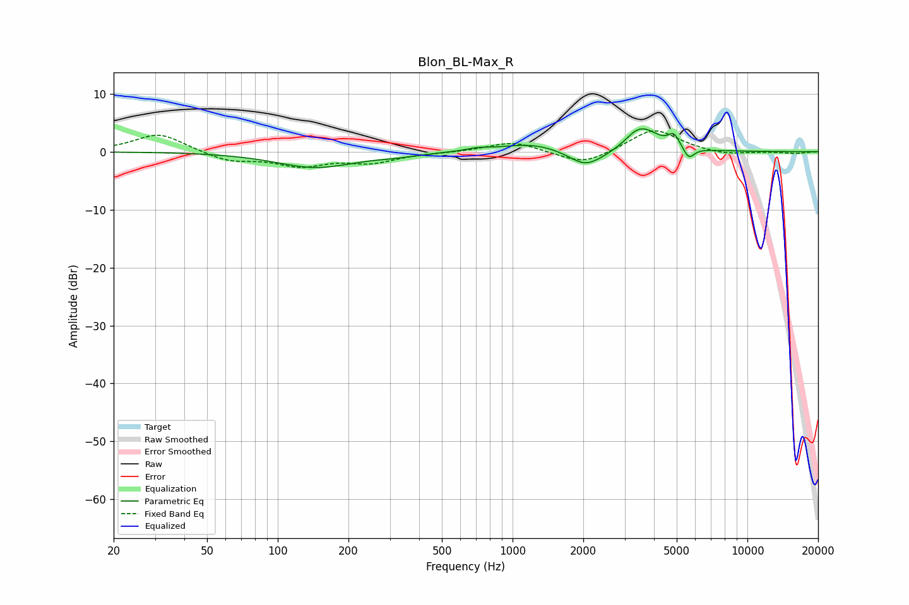

# Blon_BL-Max_R
See [usage instructions](https://github.com/jaakkopasanen/AutoEq#usage) for more options and info.

### Parametric EQs
Apply preamp of -4.0 dB when using parametric equalizer.

|   # | Type    |   Fc (Hz) |    Q |   Gain (dB) |
|-----|---------|-----------|------|-------------|
|   1 | Peaking |       145 | 0.84 |        -2.7 |
|   2 | Peaking |       323 | 1.53 |        -0.4 |
|   3 | Peaking |       708 | 2.98 |         0.4 |
|   4 | Peaking |      1199 | 1.11 |         1.5 |
|   5 | Peaking |      2028 | 2.07 |        -2.6 |
|   6 | Peaking |      2517 | 1.5  |        -0.8 |
|   7 | Peaking |      3358 | 3.59 |         0.5 |
|   8 | Peaking |      3566 | 1.88 |         4.1 |
|   9 | Peaking |      4866 | 6    |         2.1 |
|  10 | Peaking |      5629 | 6    |        -2   |

### Fixed Band EQs
When using fixed band (also called graphic) equalizer, apply preamp of **-3.7 dB** (if available) and set gains manually with these parameters.

|   # | Type    |   Fc (Hz) |    Q |   Gain (dB) |
|-----|---------|-----------|------|-------------|
|   1 | Peaking |        31 | 1.41 |         3.2 |
|   2 | Peaking |        62 | 1.41 |        -1.6 |
|   3 | Peaking |       125 | 1.41 |        -2.2 |
|   4 | Peaking |       250 | 1.41 |        -1.7 |
|   5 | Peaking |       500 | 1.41 |        -0.1 |
|   6 | Peaking |      1000 | 1.41 |         1.8 |
|   7 | Peaking |      2000 | 1.41 |        -2.4 |
|   8 | Peaking |      4000 | 1.41 |         4   |
|   9 | Peaking |      8000 | 1.41 |        -0.6 |
|  10 | Peaking |     16000 | 1.41 |        -0.3 |

### Graphs

