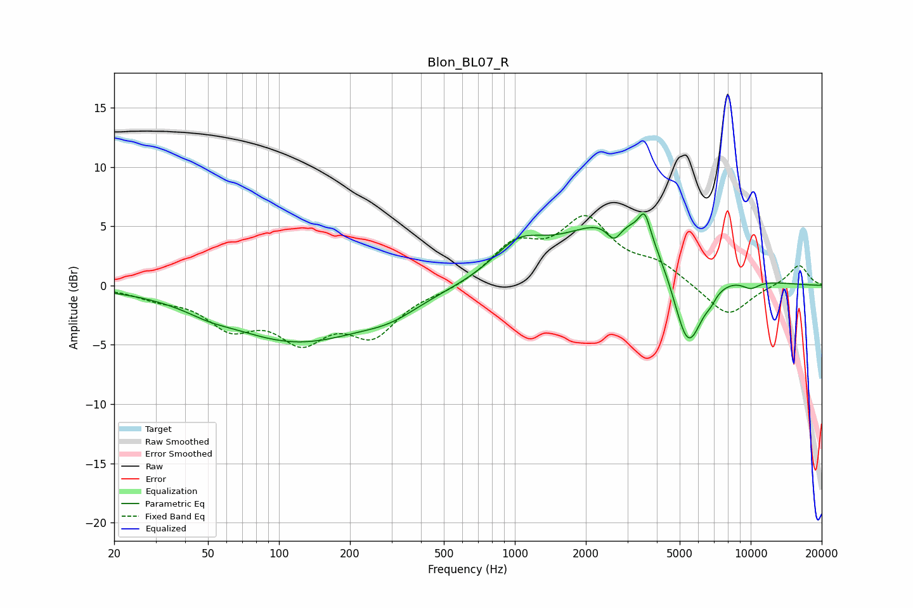

# Blon_BL07_R
See [usage instructions](https://github.com/jaakkopasanen/AutoEq#usage) for more options and info.

### Parametric EQs
Apply preamp of -6.1 dB when using parametric equalizer.

|   # | Type    |   Fc (Hz) |    Q |   Gain (dB) |
|-----|---------|-----------|------|-------------|
|   1 | Peaking |        50 | 1.64 |        -0.4 |
|   2 | Peaking |       120 | 0.44 |        -4.6 |
|   3 | Peaking |       298 | 1.22 |        -0.9 |
|   4 | Peaking |      1032 | 1.34 |         2.5 |
|   5 | Peaking |      2633 | 4.27 |        -1.7 |
|   6 | Peaking |      3045 | 0.56 |         6.3 |
|   7 | Peaking |      3553 | 6    |         2.1 |
|   8 | Peaking |      5410 | 1.96 |        -8.4 |
|   9 | Peaking |      6782 | 6    |        -0.5 |
|  10 | Peaking |     10000 | 3.2  |        -0.7 |

### Fixed Band EQs
When using fixed band (also called graphic) equalizer, apply preamp of **-6.0 dB** (if available) and set gains manually with these parameters.

|   # | Type    |   Fc (Hz) |    Q |   Gain (dB) |
|-----|---------|-----------|------|-------------|
|   1 | Peaking |        31 | 1.41 |        -0.8 |
|   2 | Peaking |        62 | 1.41 |        -3   |
|   3 | Peaking |       125 | 1.41 |        -4   |
|   4 | Peaking |       250 | 1.41 |        -3.8 |
|   5 | Peaking |       500 | 1.41 |        -0.4 |
|   6 | Peaking |      1000 | 1.41 |         3.2 |
|   7 | Peaking |      2000 | 1.41 |         5.2 |
|   8 | Peaking |      4000 | 1.41 |         1.5 |
|   9 | Peaking |      8000 | 1.41 |        -2.7 |
|  10 | Peaking |     16000 | 1.41 |         1.8 |

### Graphs

