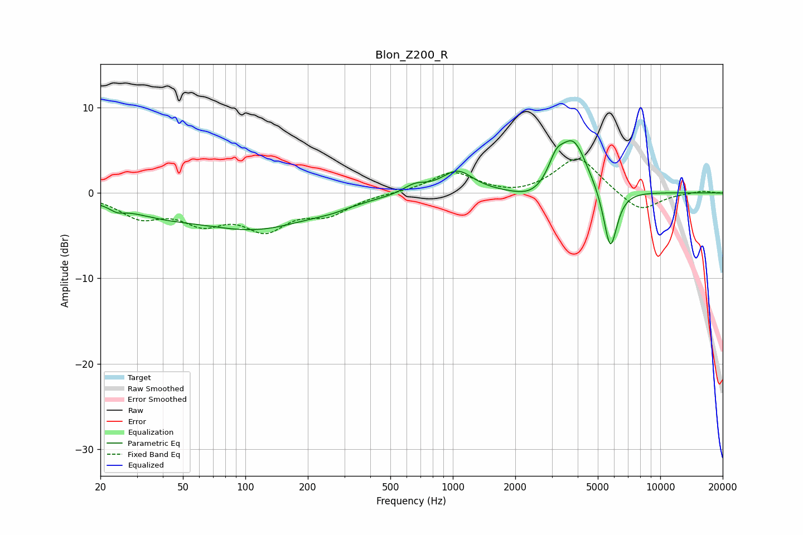

# Blon_Z200_R
See [usage instructions](https://github.com/jaakkopasanen/AutoEq#usage) for more options and info.

### Parametric EQs
Apply preamp of -6.2 dB when using parametric equalizer.

|   # | Type    |   Fc (Hz) |    Q |   Gain (dB) |
|-----|---------|-----------|------|-------------|
|   1 | Peaking |        24 | 4.14 |        -0.6 |
|   2 | Peaking |        38 | 0.7  |        -1.6 |
|   3 | Peaking |       115 | 0.51 |        -3.9 |
|   4 | Peaking |       261 | 1.71 |        -0.4 |
|   5 | Peaking |       654 | 2.51 |         1   |
|   6 | Peaking |      1051 | 1.84 |         2.6 |
|   7 | Peaking |      2436 | 1.59 |        -1.3 |
|   8 | Peaking |      3146 | 3.81 |         2.3 |
|   9 | Peaking |      3811 | 2.01 |         6.2 |
|  10 | Peaking |      5746 | 4.13 |        -7.4 |

### Fixed Band EQs
When using fixed band (also called graphic) equalizer, apply preamp of **-4.1 dB** (if available) and set gains manually with these parameters.

|   # | Type    |   Fc (Hz) |    Q |   Gain (dB) |
|-----|---------|-----------|------|-------------|
|   1 | Peaking |        31 | 1.41 |        -2.5 |
|   2 | Peaking |        62 | 1.41 |        -2.9 |
|   3 | Peaking |       125 | 1.41 |        -3.8 |
|   4 | Peaking |       250 | 1.41 |        -2.2 |
|   5 | Peaking |       500 | 1.41 |         0   |
|   6 | Peaking |      1000 | 1.41 |         2.4 |
|   7 | Peaking |      2000 | 1.41 |        -0.4 |
|   8 | Peaking |      4000 | 1.41 |         4.3 |
|   9 | Peaking |      8000 | 1.41 |        -2.3 |
|  10 | Peaking |     16000 | 1.41 |         0.3 |

### Graphs

