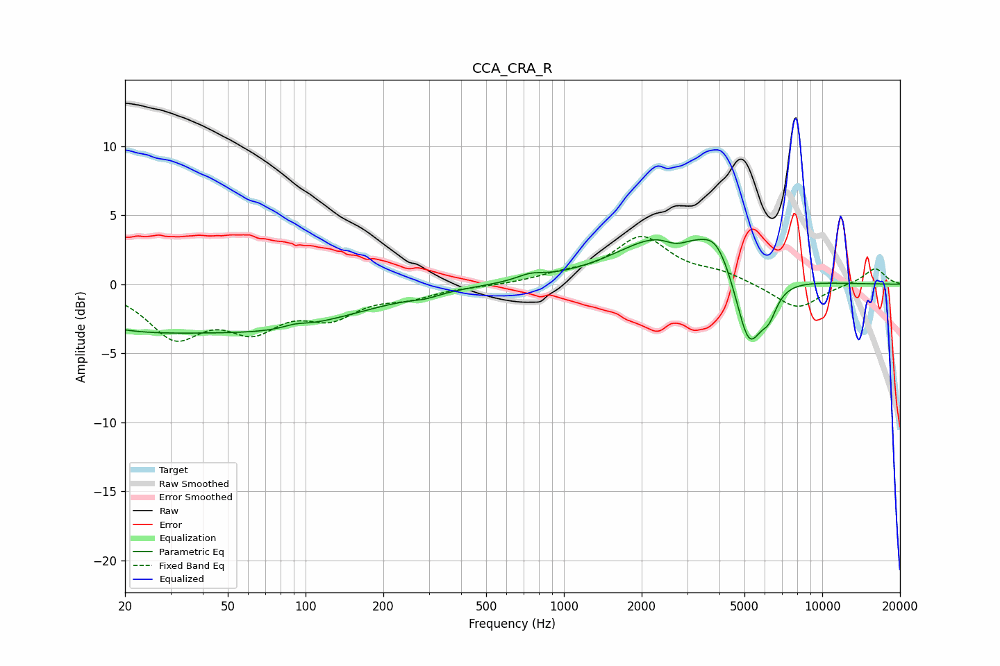

# CCA_CRA_R
See [usage instructions](https://github.com/jaakkopasanen/AutoEq#usage) for more options and info.

### Parametric EQs
Apply preamp of -3.3 dB when using parametric equalizer.

|   # | Type    |   Fc (Hz) |    Q |   Gain (dB) |
|-----|---------|-----------|------|-------------|
|   1 | Peaking |        20 | 0.47 |        -2.6 |
|   2 | Peaking |        82 | 0.44 |        -2.6 |
|   3 | Peaking |        91 | 3.17 |         0.3 |
|   4 | Peaking |       290 | 2.71 |        -0.2 |
|   5 | Peaking |       741 | 2.73 |         0.4 |
|   6 | Peaking |      2588 | 0.74 |         3.8 |
|   7 | Peaking |      2716 | 2.76 |        -0.8 |
|   8 | Peaking |      3902 | 2.45 |         1.8 |
|   9 | Peaking |      5203 | 2.66 |        -5.6 |
|  10 | Peaking |      6221 | 4.41 |        -1.6 |

### Fixed Band EQs
When using fixed band (also called graphic) equalizer, apply preamp of **-3.6 dB** (if available) and set gains manually with these parameters.

|   # | Type    |   Fc (Hz) |    Q |   Gain (dB) |
|-----|---------|-----------|------|-------------|
|   1 | Peaking |        31 | 1.41 |        -3.5 |
|   2 | Peaking |        62 | 1.41 |        -2.8 |
|   3 | Peaking |       125 | 1.41 |        -2   |
|   4 | Peaking |       250 | 1.41 |        -0.8 |
|   5 | Peaking |       500 | 1.41 |        -0.1 |
|   6 | Peaking |      1000 | 1.41 |         0.5 |
|   7 | Peaking |      2000 | 1.41 |         3.3 |
|   8 | Peaking |      4000 | 1.41 |         0.7 |
|   9 | Peaking |      8000 | 1.41 |        -1.8 |
|  10 | Peaking |     16000 | 1.41 |         1.2 |

### Graphs

