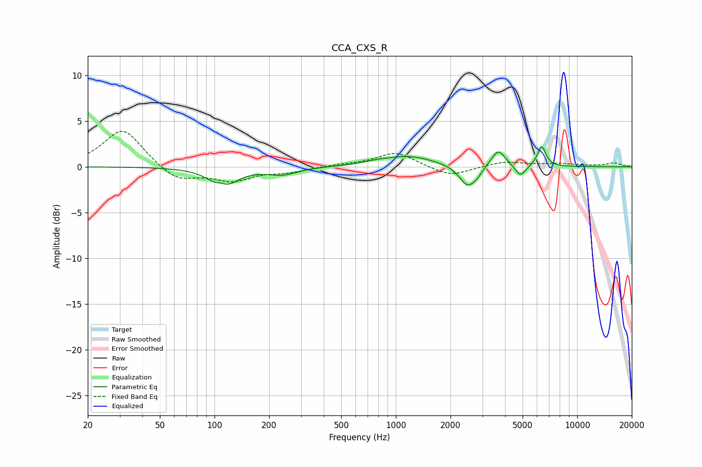

# CCA_CXS_R
See [usage instructions](https://github.com/jaakkopasanen/AutoEq#usage) for more options and info.

### Parametric EQs
Apply preamp of -2.3 dB when using parametric equalizer.

|   # | Type    |   Fc (Hz) |    Q |   Gain (dB) |
|-----|---------|-----------|------|-------------|
|   1 | Peaking |       109 | 5.03 |         0.4 |
|   2 | Peaking |       112 | 1.92 |        -2.2 |
|   3 | Peaking |       237 | 1.69 |        -0.8 |
|   4 | Peaking |       788 | 1.92 |         0.2 |
|   5 | Peaking |      1182 | 0.99 |         1.1 |
|   6 | Peaking |      2487 | 3.09 |        -2.3 |
|   7 | Peaking |      2809 | 5.85 |        -0.5 |
|   8 | Peaking |      3669 | 3.75 |         1.9 |
|   9 | Peaking |      4872 | 5.08 |        -1.2 |
|  10 | Peaking |      6367 | 5.99 |         2.2 |

### Fixed Band EQs
When using fixed band (also called graphic) equalizer, apply preamp of **-4.0 dB** (if available) and set gains manually with these parameters.

|   # | Type    |   Fc (Hz) |    Q |   Gain (dB) |
|-----|---------|-----------|------|-------------|
|   1 | Peaking |        31 | 1.41 |         4.2 |
|   2 | Peaking |        62 | 1.41 |        -1.6 |
|   3 | Peaking |       125 | 1.41 |        -1.4 |
|   4 | Peaking |       250 | 1.41 |        -0.5 |
|   5 | Peaking |       500 | 1.41 |         0.2 |
|   6 | Peaking |      1000 | 1.41 |         1.6 |
|   7 | Peaking |      2000 | 1.41 |        -1.1 |
|   8 | Peaking |      4000 | 1.41 |         0.6 |
|   9 | Peaking |      8000 | 1.41 |         0.3 |
|  10 | Peaking |     16000 | 1.41 |         0.4 |

### Graphs

