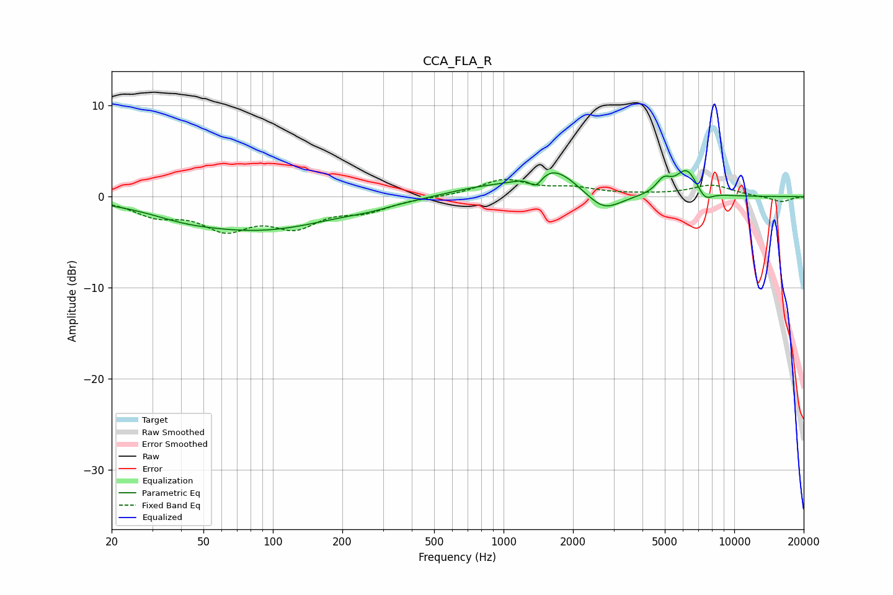

# CCA_FLA_R
See [usage instructions](https://github.com/jaakkopasanen/AutoEq#usage) for more options and info.

### Parametric EQs
Apply preamp of -3.0 dB when using parametric equalizer.

|   # | Type    |   Fc (Hz) |    Q |   Gain (dB) |
|-----|---------|-----------|------|-------------|
|   1 | Peaking |        41 | 1.01 |        -0.6 |
|   2 | Peaking |        88 | 0.43 |        -3.5 |
|   3 | Peaking |       264 | 1.45 |        -0.3 |
|   4 | Peaking |       783 | 0.89 |         0.8 |
|   5 | Peaking |      1382 | 4.93 |        -1.5 |
|   6 | Peaking |      1617 | 1.3  |         3.2 |
|   7 | Peaking |      2714 | 1.84 |        -2.2 |
|   8 | Peaking |      4939 | 4.33 |         1.5 |
|   9 | Peaking |      6223 | 2.95 |         2.9 |
|  10 | Peaking |      7471 | 4.25 |        -1.1 |

### Fixed Band EQs
When using fixed band (also called graphic) equalizer, apply preamp of **-2.0 dB** (if available) and set gains manually with these parameters.

|   # | Type    |   Fc (Hz) |    Q |   Gain (dB) |
|-----|---------|-----------|------|-------------|
|   1 | Peaking |        31 | 1.41 |        -1.8 |
|   2 | Peaking |        62 | 1.41 |        -3.1 |
|   3 | Peaking |       125 | 1.41 |        -2.9 |
|   4 | Peaking |       250 | 1.41 |        -1.3 |
|   5 | Peaking |       500 | 1.41 |        -0   |
|   6 | Peaking |      1000 | 1.41 |         1.8 |
|   7 | Peaking |      2000 | 1.41 |         0.8 |
|   8 | Peaking |      4000 | 1.41 |         0.1 |
|   9 | Peaking |      8000 | 1.41 |         1.2 |
|  10 | Peaking |     16000 | 1.41 |        -0.6 |

### Graphs

