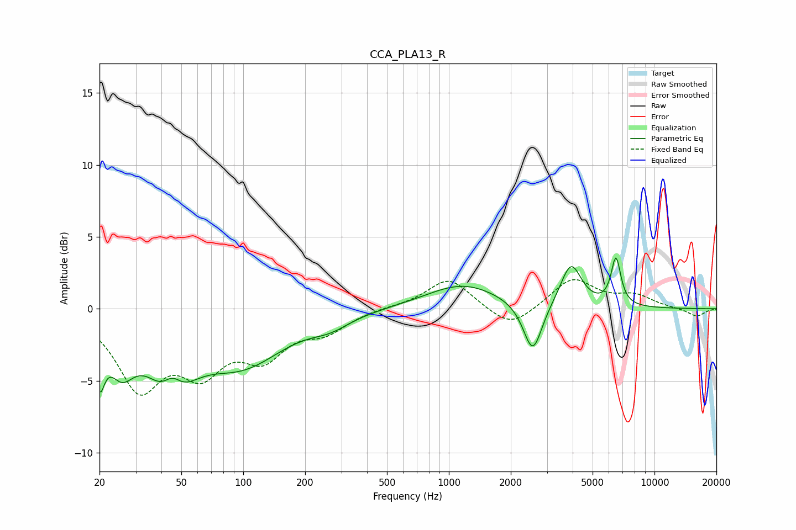

# CCA_PLA13_R
See [usage instructions](https://github.com/jaakkopasanen/AutoEq#usage) for more options and info.

### Parametric EQs
Apply preamp of -3.6 dB when using parametric equalizer.

|   # | Type    |   Fc (Hz) |    Q |   Gain (dB) |
|-----|---------|-----------|------|-------------|
|   1 | Peaking |        20 | 5.88 |        -3.4 |
|   2 | Peaking |        25 | 2.17 |        -3   |
|   3 | Peaking |        44 | 1.42 |        -5   |
|   4 | Peaking |        45 | 2.94 |         2.1 |
|   5 | Peaking |        99 | 0.69 |        -3.6 |
|   6 | Peaking |       266 | 1.49 |        -0.7 |
|   7 | Peaking |      1168 | 0.8  |         1.7 |
|   8 | Peaking |      2557 | 3.12 |        -3.6 |
|   9 | Peaking |      3926 | 2.79 |         3   |
|  10 | Peaking |      6495 | 5.85 |         3.3 |

### Fixed Band EQs
When using fixed band (also called graphic) equalizer, apply preamp of **-2.1 dB** (if available) and set gains manually with these parameters.

|   # | Type    |   Fc (Hz) |    Q |   Gain (dB) |
|-----|---------|-----------|------|-------------|
|   1 | Peaking |        31 | 1.41 |        -5.2 |
|   2 | Peaking |        62 | 1.41 |        -3.7 |
|   3 | Peaking |       125 | 1.41 |        -2.9 |
|   4 | Peaking |       250 | 1.41 |        -1.4 |
|   5 | Peaking |       500 | 1.41 |         0.1 |
|   6 | Peaking |      1000 | 1.41 |         2.2 |
|   7 | Peaking |      2000 | 1.41 |        -1.5 |
|   8 | Peaking |      4000 | 1.41 |         2.1 |
|   9 | Peaking |      8000 | 1.41 |         0.8 |
|  10 | Peaking |     16000 | 1.41 |        -0.6 |

### Graphs

