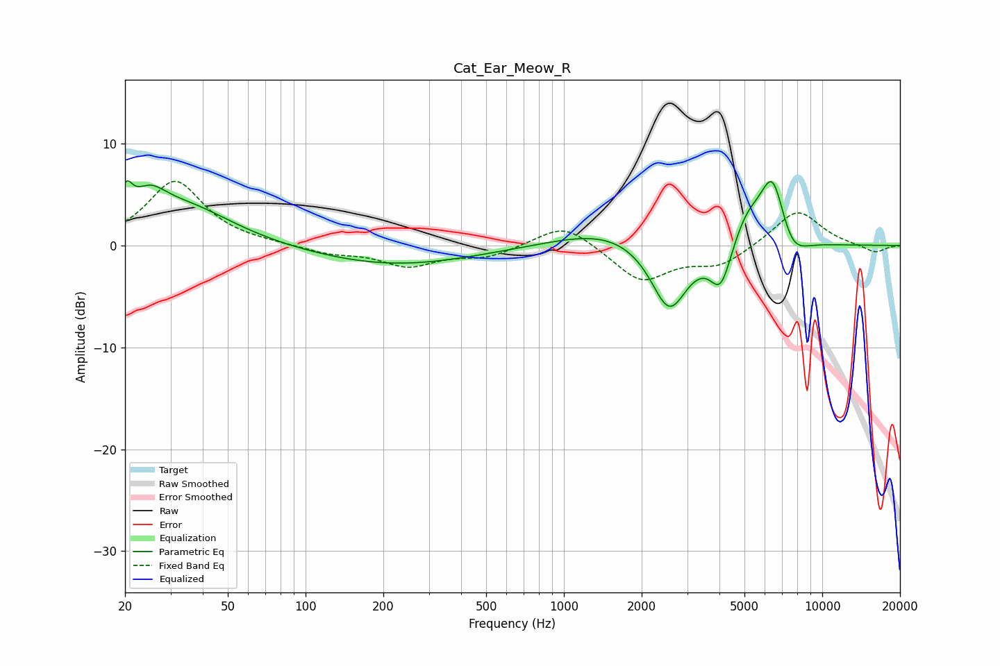

# Cat_Ear_Meow_R
See [usage instructions](https://github.com/jaakkopasanen/AutoEq#usage) for more options and info.

### Parametric EQs
Apply preamp of -6.5 dB when using parametric equalizer.

|   # | Type    |   Fc (Hz) |    Q |   Gain (dB) |
|-----|---------|-----------|------|-------------|
|   1 | Peaking |        20 | 5.99 |         2.7 |
|   2 | Peaking |        25 | 2.17 |         2.7 |
|   3 | Peaking |        34 | 0.76 |         3.7 |
|   4 | Peaking |       219 | 0.45 |        -2   |
|   5 | Peaking |      1497 | 0.7  |         1.7 |
|   6 | Peaking |      2558 | 1.95 |        -6.9 |
|   7 | Peaking |      4049 | 3.34 |        -4.3 |
|   8 | Peaking |      5118 | 2.29 |         2.8 |
|   9 | Peaking |      6428 | 2.71 |         6.9 |
|  10 | Peaking |      7588 | 2.29 |        -2.5 |

### Fixed Band EQs
When using fixed band (also called graphic) equalizer, apply preamp of **-6.4 dB** (if available) and set gains manually with these parameters.

|   # | Type    |   Fc (Hz) |    Q |   Gain (dB) |
|-----|---------|-----------|------|-------------|
|   1 | Peaking |        31 | 1.41 |         6.3 |
|   2 | Peaking |        62 | 1.41 |         0.1 |
|   3 | Peaking |       125 | 1.41 |        -0.7 |
|   4 | Peaking |       250 | 1.41 |        -1.9 |
|   5 | Peaking |       500 | 1.41 |        -1.1 |
|   6 | Peaking |      1000 | 1.41 |         2.3 |
|   7 | Peaking |      2000 | 1.41 |        -3.5 |
|   8 | Peaking |      4000 | 1.41 |        -1.9 |
|   9 | Peaking |      8000 | 1.41 |         3.6 |
|  10 | Peaking |     16000 | 1.41 |        -0.8 |

### Graphs

