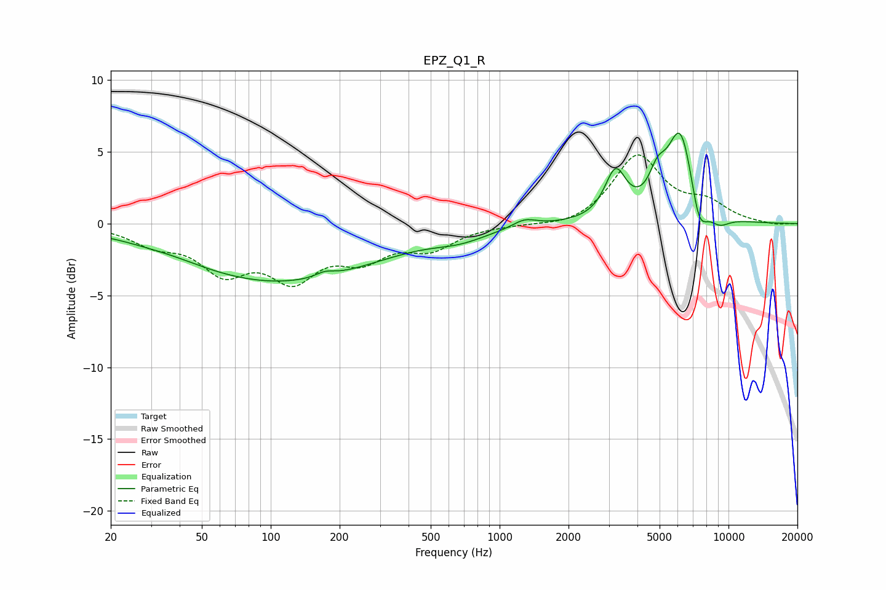

# EPZ_Q1_R
See [usage instructions](https://github.com/jaakkopasanen/AutoEq#usage) for more options and info.

### Parametric EQs
Apply preamp of -6.4 dB when using parametric equalizer.

|   # | Type    |   Fc (Hz) |    Q |   Gain (dB) |
|-----|---------|-----------|------|-------------|
|   1 | Peaking |        39 | 1.22 |         0.1 |
|   2 | Peaking |       108 | 0.32 |        -4   |
|   3 | Peaking |       172 | 3.46 |         0.4 |
|   4 | Peaking |       673 | 1.18 |        -0.6 |
|   5 | Peaking |      1285 | 2.7  |         0.6 |
|   6 | Peaking |      3209 | 3.06 |         3.3 |
|   7 | Peaking |      4893 | 3.76 |         1.9 |
|   8 | Peaking |      6171 | 2.31 |         6.5 |
|   9 | Peaking |      7430 | 3.75 |        -2.5 |
|  10 | Peaking |      9104 | 2.78 |        -0.8 |

### Fixed Band EQs
When using fixed band (also called graphic) equalizer, apply preamp of **-4.9 dB** (if available) and set gains manually with these parameters.

|   # | Type    |   Fc (Hz) |    Q |   Gain (dB) |
|-----|---------|-----------|------|-------------|
|   1 | Peaking |        31 | 1.41 |        -1.2 |
|   2 | Peaking |        62 | 1.41 |        -3   |
|   3 | Peaking |       125 | 1.41 |        -3.4 |
|   4 | Peaking |       250 | 1.41 |        -2   |
|   5 | Peaking |       500 | 1.41 |        -1.5 |
|   6 | Peaking |      1000 | 1.41 |        -0.1 |
|   7 | Peaking |      2000 | 1.41 |        -0.4 |
|   8 | Peaking |      4000 | 1.41 |         4.7 |
|   9 | Peaking |      8000 | 1.41 |         1.2 |
|  10 | Peaking |     16000 | 1.41 |        -0.1 |

### Graphs

