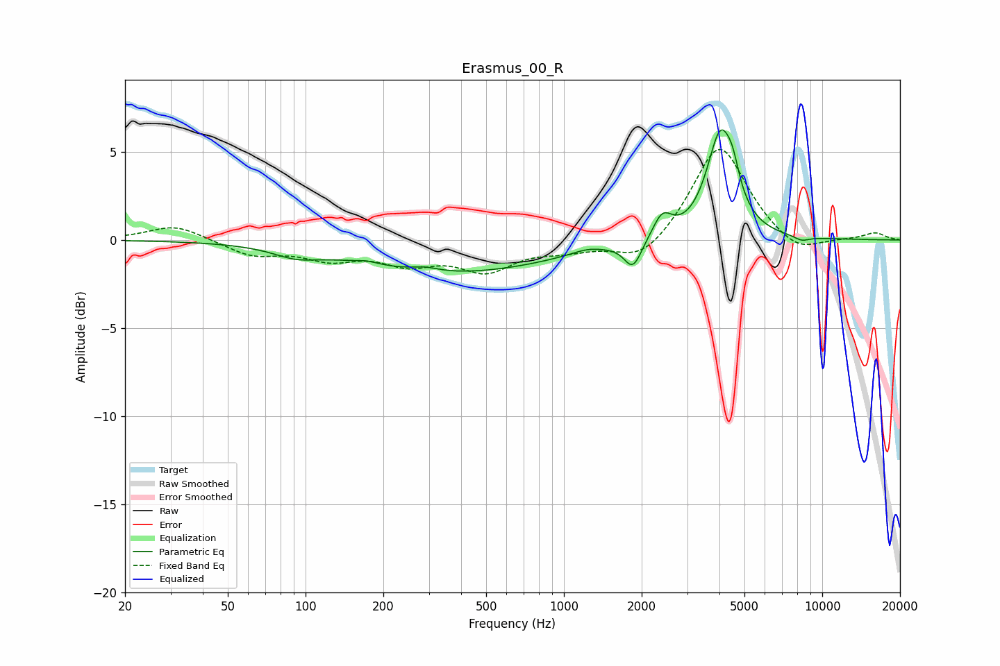

# Erasmus_00_R
See [usage instructions](https://github.com/jaakkopasanen/AutoEq#usage) for more options and info.

### Parametric EQs
Apply preamp of -6.3 dB when using parametric equalizer.

|   # | Type    |   Fc (Hz) |    Q |   Gain (dB) |
|-----|---------|-----------|------|-------------|
|   1 | Peaking |        91 | 1.66 |        -0.5 |
|   2 | Peaking |       173 | 3.09 |         0.2 |
|   3 | Peaking |       290 | 2.68 |         0.2 |
|   4 | Peaking |       373 | 0.37 |        -1.8 |
|   5 | Peaking |      1227 | 2.43 |         0.2 |
|   6 | Peaking |      1851 | 4.18 |        -1.5 |
|   7 | Peaking |      2404 | 3.78 |         1.4 |
|   8 | Peaking |      4048 | 2.65 |         5.9 |
|   9 | Peaking |      4516 | 6    |         1   |
|  10 | Peaking |      8331 | 4.25 |        -0.3 |

### Fixed Band EQs
When using fixed band (also called graphic) equalizer, apply preamp of **-5.2 dB** (if available) and set gains manually with these parameters.

|   # | Type    |   Fc (Hz) |    Q |   Gain (dB) |
|-----|---------|-----------|------|-------------|
|   1 | Peaking |        31 | 1.41 |         0.9 |
|   2 | Peaking |        62 | 1.41 |        -0.8 |
|   3 | Peaking |       125 | 1.41 |        -0.9 |
|   4 | Peaking |       250 | 1.41 |        -1.1 |
|   5 | Peaking |       500 | 1.41 |        -1.6 |
|   6 | Peaking |      1000 | 1.41 |        -0.5 |
|   7 | Peaking |      2000 | 1.41 |        -1.4 |
|   8 | Peaking |      4000 | 1.41 |         5.5 |
|   9 | Peaking |      8000 | 1.41 |        -1   |
|  10 | Peaking |     16000 | 1.41 |         0.4 |

### Graphs

