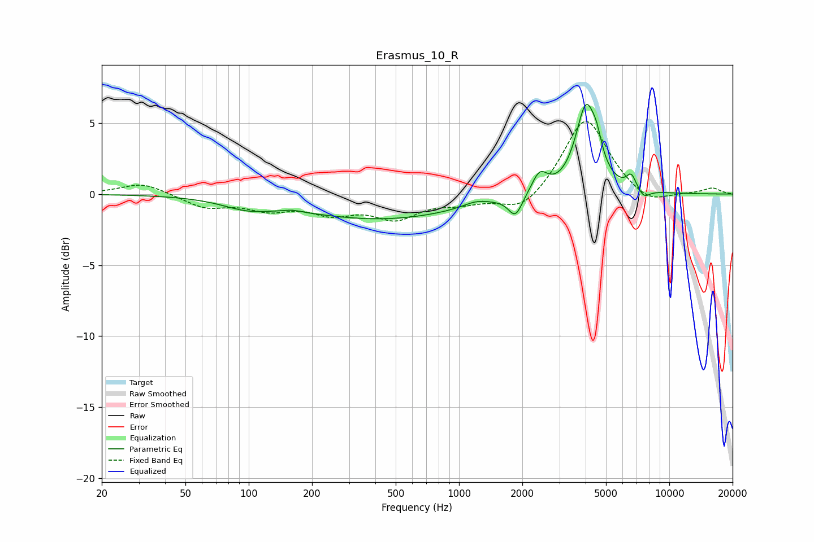

# Erasmus_10_R
See [usage instructions](https://github.com/jaakkopasanen/AutoEq#usage) for more options and info.

### Parametric EQs
Apply preamp of -6.4 dB when using parametric equalizer.

|   # | Type    |   Fc (Hz) |    Q |   Gain (dB) |
|-----|---------|-----------|------|-------------|
|   1 | Peaking |        98 | 1.2  |        -0.7 |
|   2 | Peaking |       162 | 3.73 |         0.1 |
|   3 | Peaking |       430 | 0.37 |        -1.7 |
|   4 | Peaking |      1206 | 2.25 |         0.4 |
|   5 | Peaking |      1855 | 4.32 |        -1.4 |
|   6 | Peaking |      2417 | 3.78 |         1.5 |
|   7 | Peaking |      4022 | 2.84 |         6   |
|   8 | Peaking |      4530 | 6    |         1.1 |
|   9 | Peaking |      6598 | 6    |         1   |
|  10 | Peaking |      7572 | 4.89 |        -0.6 |

### Fixed Band EQs
When using fixed band (also called graphic) equalizer, apply preamp of **-5.2 dB** (if available) and set gains manually with these parameters.

|   # | Type    |   Fc (Hz) |    Q |   Gain (dB) |
|-----|---------|-----------|------|-------------|
|   1 | Peaking |        31 | 1.41 |         0.8 |
|   2 | Peaking |        62 | 1.41 |        -0.9 |
|   3 | Peaking |       125 | 1.41 |        -0.9 |
|   4 | Peaking |       250 | 1.41 |        -1.2 |
|   5 | Peaking |       500 | 1.41 |        -1.6 |
|   6 | Peaking |      1000 | 1.41 |        -0.5 |
|   7 | Peaking |      2000 | 1.41 |        -1.4 |
|   8 | Peaking |      4000 | 1.41 |         5.5 |
|   9 | Peaking |      8000 | 1.41 |        -0.9 |
|  10 | Peaking |     16000 | 1.41 |         0.4 |

### Graphs

