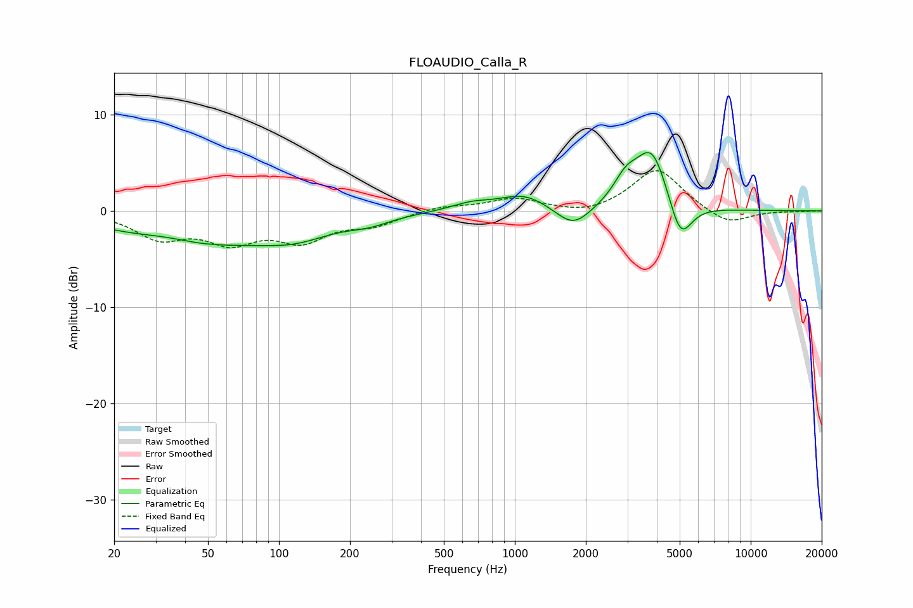

# FLOAUDIO_Calla_R
See [usage instructions](https://github.com/jaakkopasanen/AutoEq#usage) for more options and info.

### Parametric EQs
Apply preamp of -6.2 dB when using parametric equalizer.

|   # | Type    |   Fc (Hz) |    Q |   Gain (dB) |
|-----|---------|-----------|------|-------------|
|   1 | Peaking |        33 | 1.3  |         0.5 |
|   2 | Peaking |        46 | 0.42 |        -3.3 |
|   3 | Peaking |       119 | 0.94 |        -1.5 |
|   4 | Peaking |       242 | 1.53 |        -0.7 |
|   5 | Peaking |       655 | 1.61 |         0.7 |
|   6 | Peaking |      1095 | 1.38 |         1.6 |
|   7 | Peaking |      1769 | 1.92 |        -2.2 |
|   8 | Peaking |      2961 | 2.63 |         2.4 |
|   9 | Peaking |      3818 | 2.02 |         6.3 |
|  10 | Peaking |      5030 | 2.85 |        -4.5 |

### Fixed Band EQs
When using fixed band (also called graphic) equalizer, apply preamp of **-4.3 dB** (if available) and set gains manually with these parameters.

|   # | Type    |   Fc (Hz) |    Q |   Gain (dB) |
|-----|---------|-----------|------|-------------|
|   1 | Peaking |        31 | 1.41 |        -2.6 |
|   2 | Peaking |        62 | 1.41 |        -2.8 |
|   3 | Peaking |       125 | 1.41 |        -2.8 |
|   4 | Peaking |       250 | 1.41 |        -1.3 |
|   5 | Peaking |       500 | 1.41 |         0.5 |
|   6 | Peaking |      1000 | 1.41 |         1.3 |
|   7 | Peaking |      2000 | 1.41 |        -0.5 |
|   8 | Peaking |      4000 | 1.41 |         4.4 |
|   9 | Peaking |      8000 | 1.41 |        -1.5 |
|  10 | Peaking |     16000 | 1.41 |        -0.1 |

### Graphs

