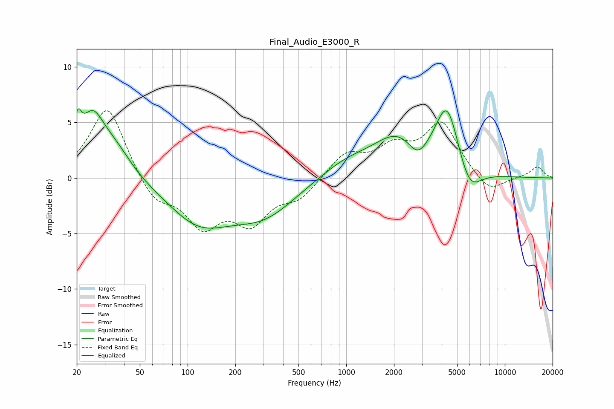

# Final_Audio_E3000_R
See [usage instructions](https://github.com/jaakkopasanen/AutoEq#usage) for more options and info.

### Parametric EQs
Apply preamp of -6.3 dB when using parametric equalizer.

|   # | Type    |   Fc (Hz) |    Q |   Gain (dB) |
|-----|---------|-----------|------|-------------|
|   1 | Peaking |        20 | 5.99 |         2.8 |
|   2 | Peaking |        25 | 1.85 |         4.8 |
|   3 | Peaking |        35 | 1.3  |         2.3 |
|   4 | Peaking |       118 | 0.71 |        -3.7 |
|   5 | Peaking |       304 | 0.7  |        -3   |
|   6 | Peaking |      1005 | 0.82 |         1.4 |
|   7 | Peaking |      2115 | 0.93 |         3.4 |
|   8 | Peaking |      2824 | 2.36 |        -1.6 |
|   9 | Peaking |      4325 | 1.87 |         6   |
|  10 | Peaking |      5964 | 1.93 |        -2.6 |

### Fixed Band EQs
When using fixed band (also called graphic) equalizer, apply preamp of **-6.2 dB** (if available) and set gains manually with these parameters.

|   # | Type    |   Fc (Hz) |    Q |   Gain (dB) |
|-----|---------|-----------|------|-------------|
|   1 | Peaking |        31 | 1.41 |         6.6 |
|   2 | Peaking |        62 | 1.41 |        -2.2 |
|   3 | Peaking |       125 | 1.41 |        -4   |
|   4 | Peaking |       250 | 1.41 |        -3.6 |
|   5 | Peaking |       500 | 1.41 |        -1.7 |
|   6 | Peaking |      1000 | 1.41 |         2.1 |
|   7 | Peaking |      2000 | 1.41 |         2.4 |
|   8 | Peaking |      4000 | 1.41 |         4.8 |
|   9 | Peaking |      8000 | 1.41 |        -1.5 |
|  10 | Peaking |     16000 | 1.41 |         1   |

### Graphs

