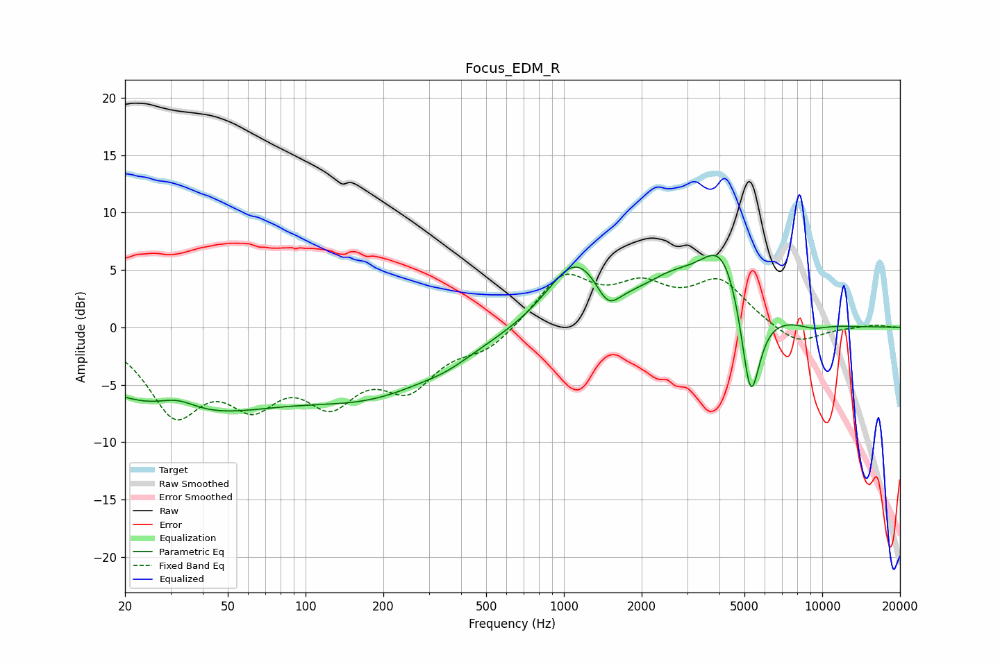

# Focus_EDM_R
See [usage instructions](https://github.com/jaakkopasanen/AutoEq#usage) for more options and info.

### Parametric EQs
Apply preamp of -6.4 dB when using parametric equalizer.

|   # | Type    |   Fc (Hz) |    Q |   Gain (dB) |
|-----|---------|-----------|------|-------------|
|   1 | Peaking |        32 | 1.81 |         1.2 |
|   2 | Peaking |        33 | 0.36 |        -7.1 |
|   3 | Peaking |       189 | 0.49 |        -4.7 |
|   4 | Peaking |       354 | 1.58 |        -0.5 |
|   5 | Peaking |      1112 | 1.25 |         5.8 |
|   6 | Peaking |      1481 | 3.07 |        -2.2 |
|   7 | Peaking |      2585 | 1.24 |         2.5 |
|   8 | Peaking |      4146 | 1.47 |         6.8 |
|   9 | Peaking |      5278 | 3.56 |        -9.9 |
|  10 | Peaking |      9228 | 2.33 |        -0.4 |

### Fixed Band EQs
When using fixed band (also called graphic) equalizer, apply preamp of **-4.7 dB** (if available) and set gains manually with these parameters.

|   # | Type    |   Fc (Hz) |    Q |   Gain (dB) |
|-----|---------|-----------|------|-------------|
|   1 | Peaking |        31 | 1.41 |        -6.8 |
|   2 | Peaking |        62 | 1.41 |        -5.1 |
|   3 | Peaking |       125 | 1.41 |        -5.3 |
|   4 | Peaking |       250 | 1.41 |        -4.5 |
|   5 | Peaking |       500 | 1.41 |        -1.8 |
|   6 | Peaking |      1000 | 1.41 |         4.5 |
|   7 | Peaking |      2000 | 1.41 |         3   |
|   8 | Peaking |      4000 | 1.41 |         3.8 |
|   9 | Peaking |      8000 | 1.41 |        -1.6 |
|  10 | Peaking |     16000 | 1.41 |         0.2 |

### Graphs

