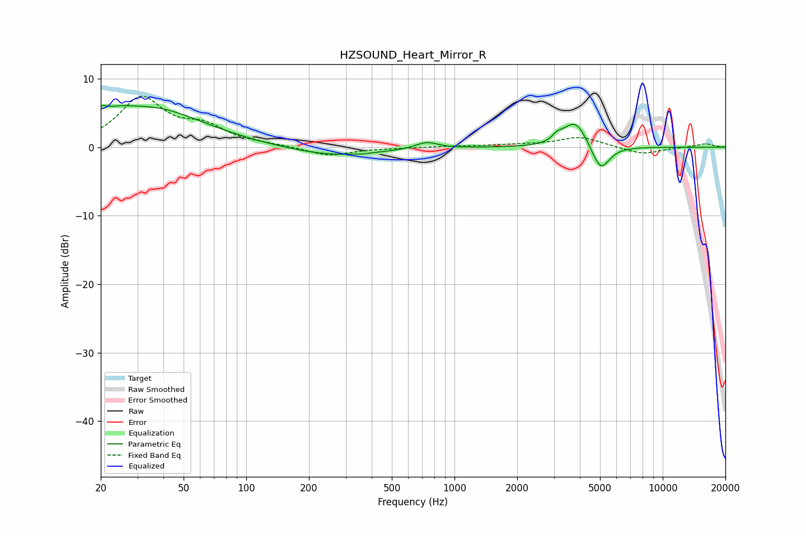

# HZSOUND_Heart_Mirror_R
See [usage instructions](https://github.com/jaakkopasanen/AutoEq#usage) for more options and info.

### Parametric EQs
Apply preamp of -6.2 dB when using parametric equalizer.

|   # | Type    |   Fc (Hz) |    Q |   Gain (dB) |
|-----|---------|-----------|------|-------------|
|   1 | Peaking |        20 | 5.79 |         1.3 |
|   2 | Peaking |        24 | 2.07 |         1   |
|   3 | Peaking |        34 | 0.55 |         5.6 |
|   4 | Peaking |       261 | 0.64 |        -1.3 |
|   5 | Peaking |       362 | 5.97 |        -0.1 |
|   6 | Peaking |       735 | 2.66 |         1   |
|   7 | Peaking |      3103 | 5.94 |         0.9 |
|   8 | Peaking |      3365 | 5.27 |         0.3 |
|   9 | Peaking |      3825 | 2.66 |         3.8 |
|  10 | Peaking |      5037 | 3.33 |        -3.8 |

### Fixed Band EQs
When using fixed band (also called graphic) equalizer, apply preamp of **-7.6 dB** (if available) and set gains manually with these parameters.

|   # | Type    |   Fc (Hz) |    Q |   Gain (dB) |
|-----|---------|-----------|------|-------------|
|   1 | Peaking |        31 | 1.41 |         7   |
|   2 | Peaking |        62 | 1.41 |         2.6 |
|   3 | Peaking |       125 | 1.41 |         0.2 |
|   4 | Peaking |       250 | 1.41 |        -1.3 |
|   5 | Peaking |       500 | 1.41 |        -0.1 |
|   6 | Peaking |      1000 | 1.41 |         0.1 |
|   7 | Peaking |      2000 | 1.41 |         0.3 |
|   8 | Peaking |      4000 | 1.41 |         1.5 |
|   9 | Peaking |      8000 | 1.41 |        -1.1 |
|  10 | Peaking |     16000 | 1.41 |         0.5 |

### Graphs

