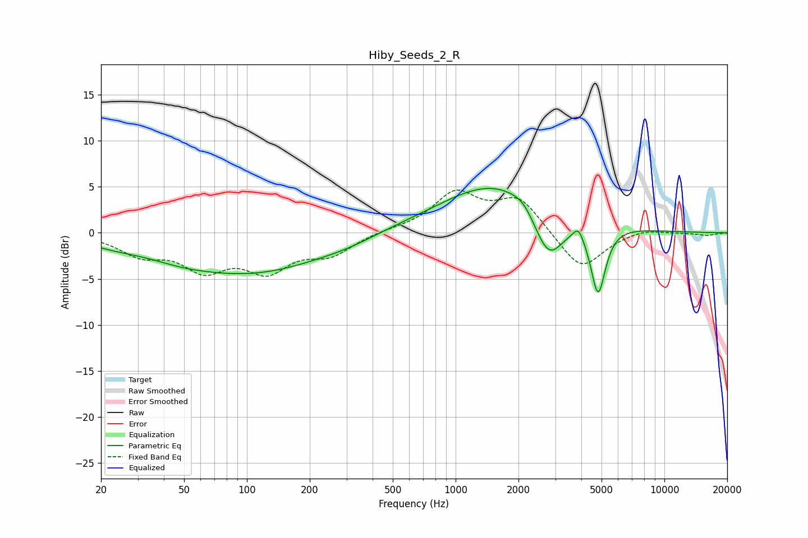

# Hiby_Seeds_2_R
See [usage instructions](https://github.com/jaakkopasanen/AutoEq#usage) for more options and info.

### Parametric EQs
Apply preamp of -4.9 dB when using parametric equalizer.

|   # | Type    |   Fc (Hz) |    Q |   Gain (dB) |
|-----|---------|-----------|------|-------------|
|   1 | Peaking |        23 | 1.03 |        -0.6 |
|   2 | Peaking |        47 | 0.99 |        -0.6 |
|   3 | Peaking |       103 | 0.39 |        -4.3 |
|   4 | Peaking |       299 | 1.22 |        -0.3 |
|   5 | Peaking |       505 | 1.43 |         0.1 |
|   6 | Peaking |      1635 | 0.51 |         5.8 |
|   7 | Peaking |      2107 | 2.96 |         0.7 |
|   8 | Peaking |      2783 | 1.87 |        -5.9 |
|   9 | Peaking |      3874 | 5.98 |         1.3 |
|  10 | Peaking |      4815 | 3.94 |        -7.6 |

### Fixed Band EQs
When using fixed band (also called graphic) equalizer, apply preamp of **-4.7 dB** (if available) and set gains manually with these parameters.

|   # | Type    |   Fc (Hz) |    Q |   Gain (dB) |
|-----|---------|-----------|------|-------------|
|   1 | Peaking |        31 | 1.41 |        -2.1 |
|   2 | Peaking |        62 | 1.41 |        -3.5 |
|   3 | Peaking |       125 | 1.41 |        -3.6 |
|   4 | Peaking |       250 | 1.41 |        -2.1 |
|   5 | Peaking |       500 | 1.41 |         0.3 |
|   6 | Peaking |      1000 | 1.41 |         4.1 |
|   7 | Peaking |      2000 | 1.41 |         3.7 |
|   8 | Peaking |      4000 | 1.41 |        -4.2 |
|   9 | Peaking |      8000 | 1.41 |         0.5 |
|  10 | Peaking |     16000 | 1.41 |        -0.3 |

### Graphs

