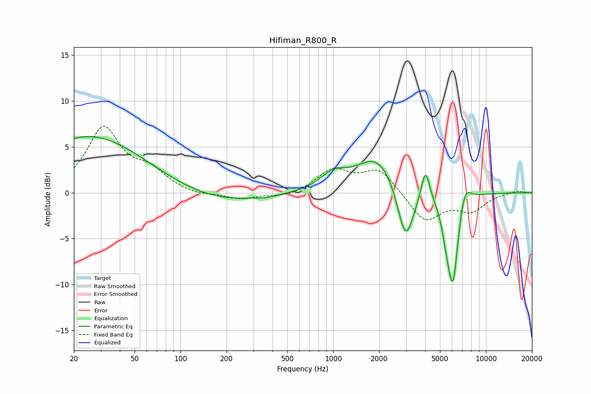

# Hifiman_R800_R
See [usage instructions](https://github.com/jaakkopasanen/AutoEq#usage) for more options and info.

### Parametric EQs
Apply preamp of -6.2 dB when using parametric equalizer.

|   # | Type    |   Fc (Hz) |    Q |   Gain (dB) |
|-----|---------|-----------|------|-------------|
|   1 | Peaking |        26 | 0.39 |         6.2 |
|   2 | Peaking |       175 | 0.48 |        -1.2 |
|   3 | Peaking |       371 | 2.09 |        -0.2 |
|   4 | Peaking |      1002 | 1.75 |         1.6 |
|   5 | Peaking |      1955 | 1.04 |         4.1 |
|   6 | Peaking |      2976 | 2.58 |        -6.5 |
|   7 | Peaking |      4013 | 5.12 |         3.5 |
|   8 | Peaking |      5493 | 4.82 |        -2.1 |
|   9 | Peaking |      6078 | 3.88 |        -9.6 |
|  10 | Peaking |      7259 | 3.56 |         2.4 |

### Fixed Band EQs
When using fixed band (also called graphic) equalizer, apply preamp of **-7.3 dB** (if available) and set gains manually with these parameters.

|   # | Type    |   Fc (Hz) |    Q |   Gain (dB) |
|-----|---------|-----------|------|-------------|
|   1 | Peaking |        31 | 1.41 |         6.9 |
|   2 | Peaking |        62 | 1.41 |         2   |
|   3 | Peaking |       125 | 1.41 |        -0.4 |
|   4 | Peaking |       250 | 1.41 |        -0.7 |
|   5 | Peaking |       500 | 1.41 |        -0.5 |
|   6 | Peaking |      1000 | 1.41 |         2.4 |
|   7 | Peaking |      2000 | 1.41 |         2.5 |
|   8 | Peaking |      4000 | 1.41 |        -3.2 |
|   9 | Peaking |      8000 | 1.41 |        -1.8 |
|  10 | Peaking |     16000 | 1.41 |         0.3 |

### Graphs

