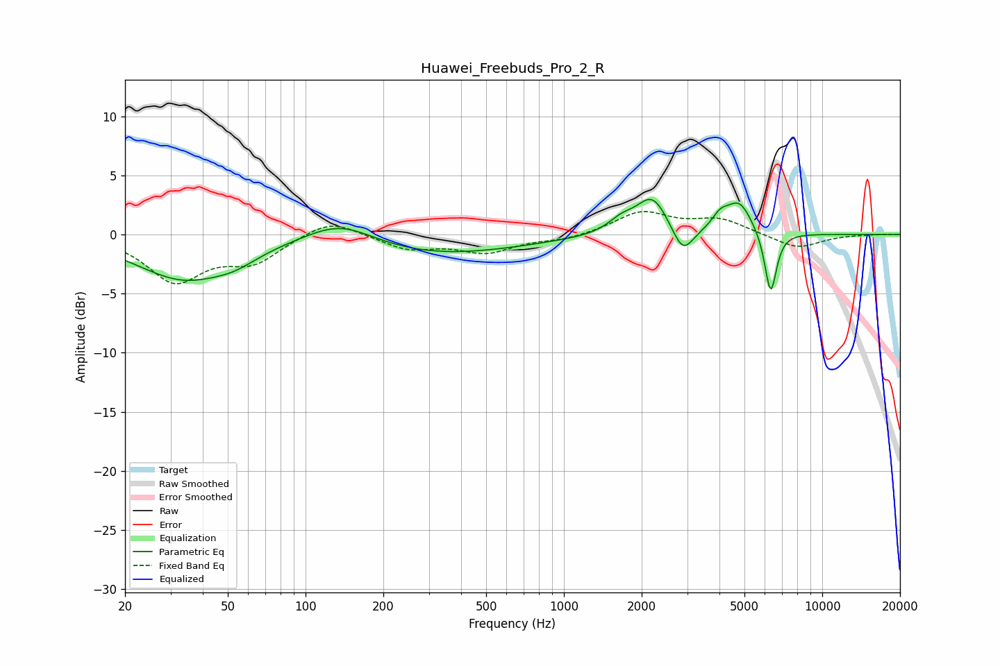

# Huawei_Freebuds_Pro_2_R
See [usage instructions](https://github.com/jaakkopasanen/AutoEq#usage) for more options and info.

### Parametric EQs
Apply preamp of -3.1 dB when using parametric equalizer.

|   # | Type    |   Fc (Hz) |    Q |   Gain (dB) |
|-----|---------|-----------|------|-------------|
|   1 | Peaking |        34 | 0.76 |        -3.7 |
|   2 | Peaking |        53 | 1.65 |        -0.8 |
|   3 | Peaking |       136 | 1.04 |         2   |
|   4 | Peaking |       310 | 0.42 |        -1.7 |
|   5 | Peaking |      1672 | 2.67 |         1   |
|   6 | Peaking |      2203 | 2.33 |         3.2 |
|   7 | Peaking |      2885 | 3.43 |        -2.4 |
|   8 | Peaking |      4031 | 4.42 |         1.1 |
|   9 | Peaking |      4773 | 2.8  |         2.7 |
|  10 | Peaking |      6314 | 6    |        -5.4 |

### Fixed Band EQs
When using fixed band (also called graphic) equalizer, apply preamp of **-2.0 dB** (if available) and set gains manually with these parameters.

|   # | Type    |   Fc (Hz) |    Q |   Gain (dB) |
|-----|---------|-----------|------|-------------|
|   1 | Peaking |        31 | 1.41 |        -3.8 |
|   2 | Peaking |        62 | 1.41 |        -2.1 |
|   3 | Peaking |       125 | 1.41 |         1.5 |
|   4 | Peaking |       250 | 1.41 |        -1.2 |
|   5 | Peaking |       500 | 1.41 |        -1.4 |
|   6 | Peaking |      1000 | 1.41 |        -0.4 |
|   7 | Peaking |      2000 | 1.41 |         1.9 |
|   8 | Peaking |      4000 | 1.41 |         1.2 |
|   9 | Peaking |      8000 | 1.41 |        -1.2 |
|  10 | Peaking |     16000 | 1.41 |         0   |

### Graphs

