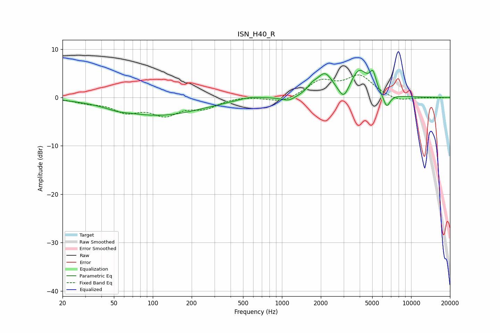

# ISN_H40_R
See [usage instructions](https://github.com/jaakkopasanen/AutoEq#usage) for more options and info.

### Parametric EQs
Apply preamp of -5.7 dB when using parametric equalizer.

|   # | Type    |   Fc (Hz) |    Q |   Gain (dB) |
|-----|---------|-----------|------|-------------|
|   1 | Peaking |        53 | 1.74 |        -0.5 |
|   2 | Peaking |       112 | 0.43 |        -3.6 |
|   3 | Peaking |       564 | 1.61 |         0.6 |
|   4 | Peaking |      1131 | 2.75 |        -1   |
|   5 | Peaking |      1716 | 3.9  |         1.1 |
|   6 | Peaking |      2149 | 2.27 |         4.5 |
|   7 | Peaking |      3014 | 3.5  |        -3   |
|   8 | Peaking |      3963 | 2.02 |         5.5 |
|   9 | Peaking |      5065 | 5.92 |         3.3 |
|  10 | Peaking |      6462 | 5.1  |        -2.9 |

### Fixed Band EQs
When using fixed band (also called graphic) equalizer, apply preamp of **-4.8 dB** (if available) and set gains manually with these parameters.

|   # | Type    |   Fc (Hz) |    Q |   Gain (dB) |
|-----|---------|-----------|------|-------------|
|   1 | Peaking |        31 | 1.41 |        -0.9 |
|   2 | Peaking |        62 | 1.41 |        -2.6 |
|   3 | Peaking |       125 | 1.41 |        -3.2 |
|   4 | Peaking |       250 | 1.41 |        -1.9 |
|   5 | Peaking |       500 | 1.41 |         0.3 |
|   6 | Peaking |      1000 | 1.41 |        -1.2 |
|   7 | Peaking |      2000 | 1.41 |         3.2 |
|   8 | Peaking |      4000 | 1.41 |         4.3 |
|   9 | Peaking |      8000 | 1.41 |        -1   |
|  10 | Peaking |     16000 | 1.41 |        -0.1 |

### Graphs

