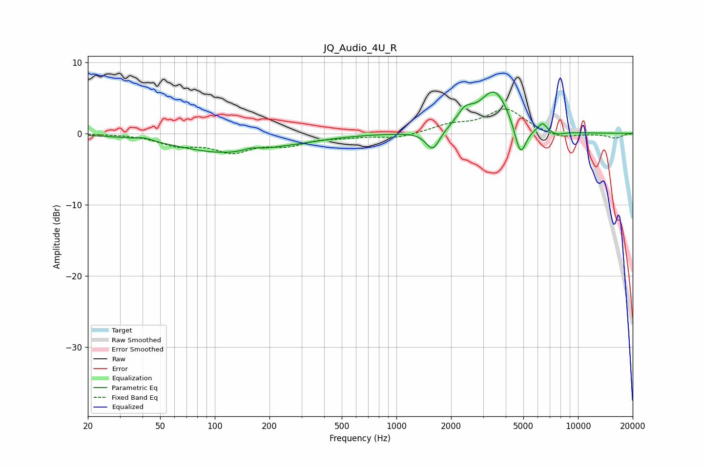

# JQ_Audio_4U_R
See [usage instructions](https://github.com/jaakkopasanen/AutoEq#usage) for more options and info.

### Parametric EQs
Apply preamp of -5.9 dB when using parametric equalizer.

|   # | Type    |   Fc (Hz) |    Q |   Gain (dB) |
|-----|---------|-----------|------|-------------|
|   1 | Peaking |        41 | 3.65 |         0.4 |
|   2 | Peaking |       114 | 0.52 |        -2.7 |
|   3 | Peaking |       159 | 3.53 |         0.4 |
|   4 | Peaking |       312 | 0.9  |        -0.3 |
|   5 | Peaking |      1584 | 3.78 |        -2.8 |
|   6 | Peaking |      2385 | 3.1  |         2   |
|   7 | Peaking |      3473 | 1.7  |         6   |
|   8 | Peaking |      4816 | 4.26 |        -4.9 |
|   9 | Peaking |      6378 | 6    |         1.2 |
|  10 | Peaking |      7585 | 3.07 |        -0.5 |

### Fixed Band EQs
When using fixed band (also called graphic) equalizer, apply preamp of **-3.5 dB** (if available) and set gains manually with these parameters.

|   # | Type    |   Fc (Hz) |    Q |   Gain (dB) |
|-----|---------|-----------|------|-------------|
|   1 | Peaking |        31 | 1.41 |        -0   |
|   2 | Peaking |        62 | 1.41 |        -1.5 |
|   3 | Peaking |       125 | 1.41 |        -2.3 |
|   4 | Peaking |       250 | 1.41 |        -1.4 |
|   5 | Peaking |       500 | 1.41 |        -0.4 |
|   6 | Peaking |      1000 | 1.41 |        -0.7 |
|   7 | Peaking |      2000 | 1.41 |         1.1 |
|   8 | Peaking |      4000 | 1.41 |         3.4 |
|   9 | Peaking |      8000 | 1.41 |        -0.8 |
|  10 | Peaking |     16000 | 1.41 |        -0.6 |

### Graphs

