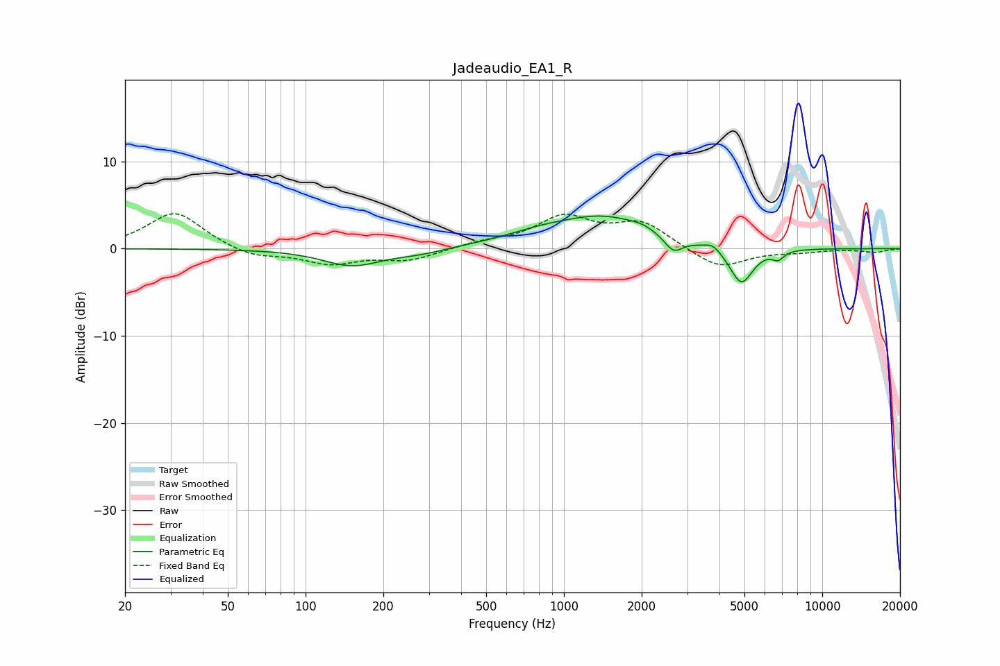

# Jadeaudio_EA1_R
See [usage instructions](https://github.com/jaakkopasanen/AutoEq#usage) for more options and info.

### Parametric EQs
Apply preamp of -3.8 dB when using parametric equalizer.

|   # | Type    |   Fc (Hz) |    Q |   Gain (dB) |
|-----|---------|-----------|------|-------------|
|   1 | Peaking |       152 | 1.24 |        -1.9 |
|   2 | Peaking |       275 | 1.5  |        -0.5 |
|   3 | Peaking |       529 | 1.6  |         0.1 |
|   4 | Peaking |       788 | 1.21 |         0.8 |
|   5 | Peaking |      1416 | 0.76 |         3.5 |
|   6 | Peaking |      2014 | 2.94 |         0.4 |
|   7 | Peaking |      2655 | 3.9  |        -1.8 |
|   8 | Peaking |      3775 | 4.88 |         0.7 |
|   9 | Peaking |      4863 | 3.08 |        -4.3 |
|  10 | Peaking |      6744 | 6    |        -0.9 |

### Fixed Band EQs
When using fixed band (also called graphic) equalizer, apply preamp of **-4.1 dB** (if available) and set gains manually with these parameters.

|   # | Type    |   Fc (Hz) |    Q |   Gain (dB) |
|-----|---------|-----------|------|-------------|
|   1 | Peaking |        31 | 1.41 |         4.3 |
|   2 | Peaking |        62 | 1.41 |        -1.1 |
|   3 | Peaking |       125 | 1.41 |        -1.6 |
|   4 | Peaking |       250 | 1.41 |        -1.3 |
|   5 | Peaking |       500 | 1.41 |         0.6 |
|   6 | Peaking |      1000 | 1.41 |         3.4 |
|   7 | Peaking |      2000 | 1.41 |         2.9 |
|   8 | Peaking |      4000 | 1.41 |        -2.4 |
|   9 | Peaking |      8000 | 1.41 |        -0.3 |
|  10 | Peaking |     16000 | 1.41 |        -0.4 |

### Graphs

