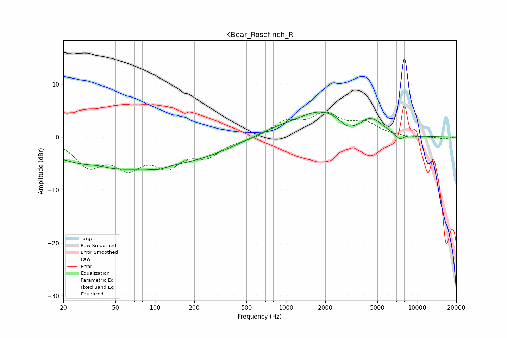

# KBear_Rosefinch_R
See [usage instructions](https://github.com/jaakkopasanen/AutoEq#usage) for more options and info.

### Parametric EQs
Apply preamp of -4.8 dB when using parametric equalizer.

|   # | Type    |   Fc (Hz) |    Q |   Gain (dB) |
|-----|---------|-----------|------|-------------|
|   1 | Peaking |        37 | 1.74 |         0.5 |
|   2 | Peaking |        42 | 0.35 |        -5.7 |
|   3 | Peaking |       105 | 2.27 |        -0.6 |
|   4 | Peaking |       208 | 0.49 |        -2.9 |
|   5 | Peaking |       873 | 0.74 |         1.3 |
|   6 | Peaking |      1914 | 0.77 |         4.5 |
|   7 | Peaking |      2960 | 2.46 |        -1.5 |
|   8 | Peaking |      4194 | 3.72 |         0.7 |
|   9 | Peaking |      4781 | 1.96 |         2   |
|  10 | Peaking |      7392 | 4.22 |        -1.1 |

### Fixed Band EQs
When using fixed band (also called graphic) equalizer, apply preamp of **-4.8 dB** (if available) and set gains manually with these parameters.

|   # | Type    |   Fc (Hz) |    Q |   Gain (dB) |
|-----|---------|-----------|------|-------------|
|   1 | Peaking |        31 | 1.41 |        -5   |
|   2 | Peaking |        62 | 1.41 |        -4.8 |
|   3 | Peaking |       125 | 1.41 |        -4.6 |
|   4 | Peaking |       250 | 1.41 |        -3.1 |
|   5 | Peaking |       500 | 1.41 |        -0.5 |
|   6 | Peaking |      1000 | 1.41 |         2.7 |
|   7 | Peaking |      2000 | 1.41 |         3.9 |
|   8 | Peaking |      4000 | 1.41 |         2.4 |
|   9 | Peaking |      8000 | 1.41 |        -0.1 |
|  10 | Peaking |     16000 | 1.41 |        -0.4 |

### Graphs

