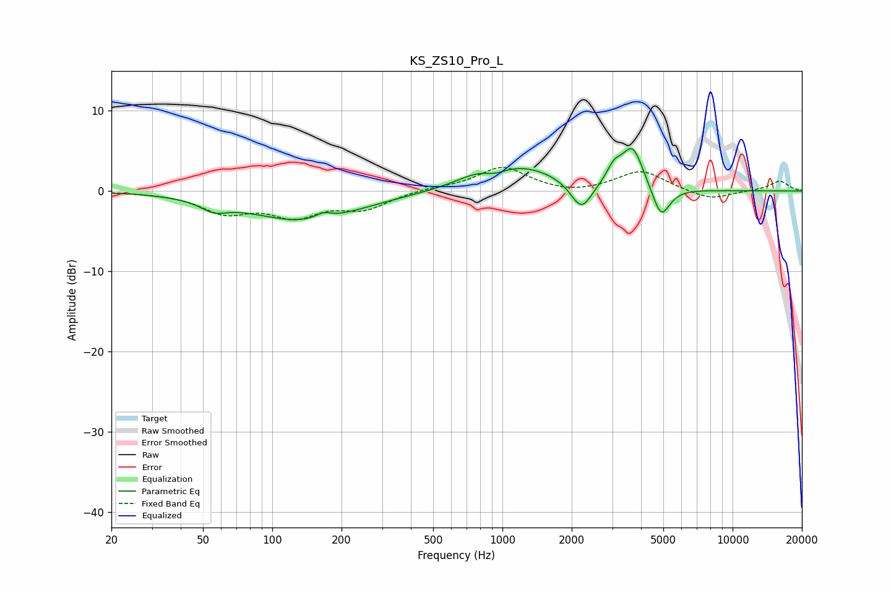

# KS_ZS10_Pro_L
See [usage instructions](https://github.com/jaakkopasanen/AutoEq#usage) for more options and info.

### Parametric EQs
Apply preamp of -5.4 dB when using parametric equalizer.

|   # | Type    |   Fc (Hz) |    Q |   Gain (dB) |
|-----|---------|-----------|------|-------------|
|   1 | Peaking |        56 | 2.47 |        -1.2 |
|   2 | Peaking |       137 | 0.58 |        -3.7 |
|   3 | Peaking |       167 | 4.29 |         0.7 |
|   4 | Peaking |       760 | 1.67 |         0.8 |
|   5 | Peaking |       936 | 3.39 |        -0.5 |
|   6 | Peaking |      1202 | 0.82 |         3   |
|   7 | Peaking |      2203 | 3.05 |        -3.6 |
|   8 | Peaking |      3055 | 4.37 |         1.9 |
|   9 | Peaking |      3677 | 2.98 |         5.2 |
|  10 | Peaking |      4886 | 3.67 |        -4   |

### Fixed Band EQs
When using fixed band (also called graphic) equalizer, apply preamp of **-3.0 dB** (if available) and set gains manually with these parameters.

|   # | Type    |   Fc (Hz) |    Q |   Gain (dB) |
|-----|---------|-----------|------|-------------|
|   1 | Peaking |        31 | 1.41 |        -0.1 |
|   2 | Peaking |        62 | 1.41 |        -2.5 |
|   3 | Peaking |       125 | 1.41 |        -2.8 |
|   4 | Peaking |       250 | 1.41 |        -2   |
|   5 | Peaking |       500 | 1.41 |         0.3 |
|   6 | Peaking |      1000 | 1.41 |         3   |
|   7 | Peaking |      2000 | 1.41 |        -0.5 |
|   8 | Peaking |      4000 | 1.41 |         2.5 |
|   9 | Peaking |      8000 | 1.41 |        -1.2 |
|  10 | Peaking |     16000 | 1.41 |         1.2 |

### Graphs

