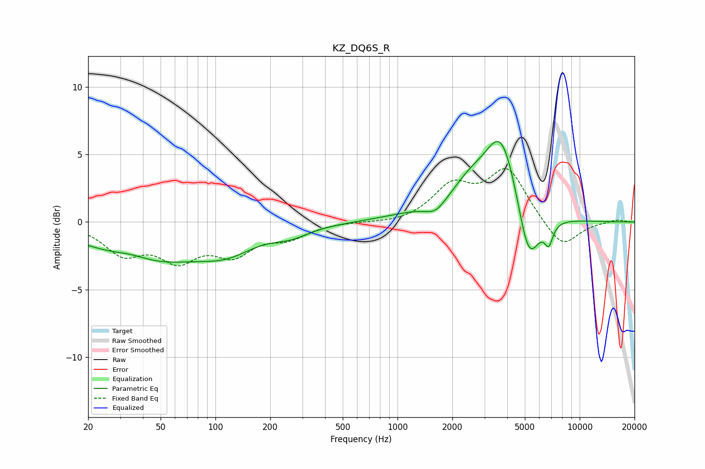

# KZ_DQ6S_R
See [usage instructions](https://github.com/jaakkopasanen/AutoEq#usage) for more options and info.

### Parametric EQs
Apply preamp of -6.1 dB when using parametric equalizer.

|   # | Type    |   Fc (Hz) |    Q |   Gain (dB) |
|-----|---------|-----------|------|-------------|
|   1 | Peaking |        34 | 1.39 |         0.5 |
|   2 | Peaking |        43 | 0.45 |        -2.9 |
|   3 | Peaking |       116 | 0.95 |        -1.3 |
|   4 | Peaking |       259 | 1.37 |        -0.7 |
|   5 | Peaking |      1114 | 0.93 |         0.4 |
|   6 | Peaking |      1618 | 2.76 |        -0.7 |
|   7 | Peaking |      2487 | 1.33 |         2   |
|   8 | Peaking |      3724 | 1.52 |         6.1 |
|   9 | Peaking |      5239 | 2.33 |        -4.6 |
|  10 | Peaking |      6762 | 5.98 |        -1.5 |

### Fixed Band EQs
When using fixed band (also called graphic) equalizer, apply preamp of **-4.1 dB** (if available) and set gains manually with these parameters.

|   # | Type    |   Fc (Hz) |    Q |   Gain (dB) |
|-----|---------|-----------|------|-------------|
|   1 | Peaking |        31 | 1.41 |        -2.1 |
|   2 | Peaking |        62 | 1.41 |        -2.4 |
|   3 | Peaking |       125 | 1.41 |        -2.1 |
|   4 | Peaking |       250 | 1.41 |        -1   |
|   5 | Peaking |       500 | 1.41 |         0   |
|   6 | Peaking |      1000 | 1.41 |        -0.2 |
|   7 | Peaking |      2000 | 1.41 |         2.5 |
|   8 | Peaking |      4000 | 1.41 |         3.8 |
|   9 | Peaking |      8000 | 1.41 |        -2   |
|  10 | Peaking |     16000 | 1.41 |         0.2 |

### Graphs

