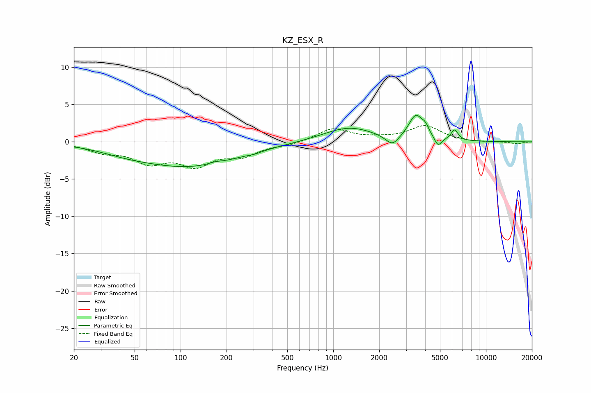

# KZ_ESX_R
See [usage instructions](https://github.com/jaakkopasanen/AutoEq#usage) for more options and info.

### Parametric EQs
Apply preamp of -3.7 dB when using parametric equalizer.

|   # | Type    |   Fc (Hz) |    Q |   Gain (dB) |
|-----|---------|-----------|------|-------------|
|   1 | Peaking |        43 | 0.84 |        -0.5 |
|   2 | Peaking |       113 | 0.42 |        -3.2 |
|   3 | Peaking |       169 | 4.06 |         0.2 |
|   4 | Peaking |       304 | 3.06 |        -0.2 |
|   5 | Peaking |      1265 | 0.85 |         2   |
|   6 | Peaking |      2437 | 3.23 |        -1.4 |
|   7 | Peaking |      3473 | 3.03 |         3.2 |
|   8 | Peaking |      4012 | 6    |         0.9 |
|   9 | Peaking |      4856 | 5.97 |        -1.3 |
|  10 | Peaking |      6229 | 6    |         1.4 |

### Fixed Band EQs
When using fixed band (also called graphic) equalizer, apply preamp of **-2.3 dB** (if available) and set gains manually with these parameters.

|   # | Type    |   Fc (Hz) |    Q |   Gain (dB) |
|-----|---------|-----------|------|-------------|
|   1 | Peaking |        31 | 1.41 |        -1.2 |
|   2 | Peaking |        62 | 1.41 |        -2.5 |
|   3 | Peaking |       125 | 1.41 |        -2.8 |
|   4 | Peaking |       250 | 1.41 |        -1.6 |
|   5 | Peaking |       500 | 1.41 |        -0.4 |
|   6 | Peaking |      1000 | 1.41 |         1.8 |
|   7 | Peaking |      2000 | 1.41 |         0.3 |
|   8 | Peaking |      4000 | 1.41 |         2.1 |
|   9 | Peaking |      8000 | 1.41 |        -0.1 |
|  10 | Peaking |     16000 | 1.41 |        -0.3 |

### Graphs

