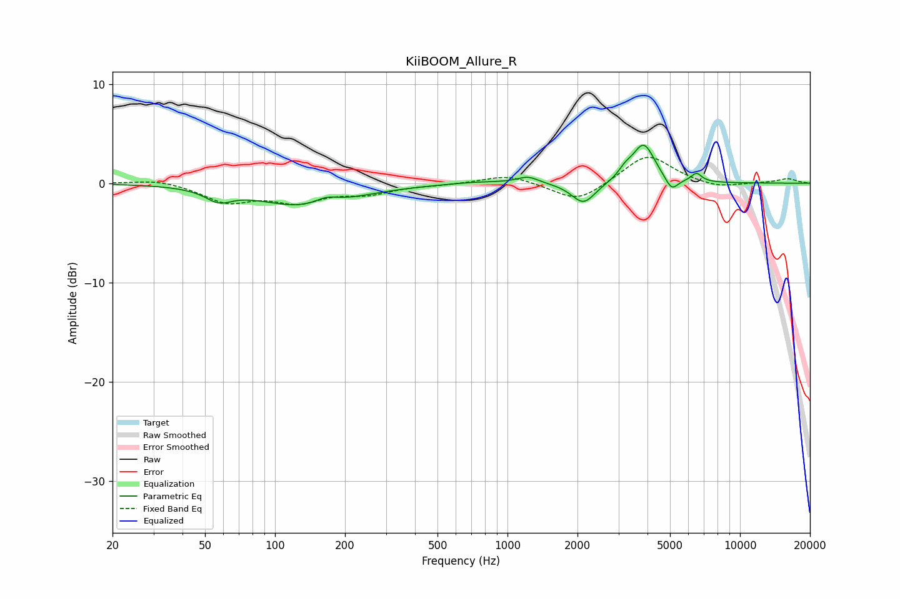

# KiiBOOM_Allure_R
See [usage instructions](https://github.com/jaakkopasanen/AutoEq#usage) for more options and info.

### Parametric EQs
Apply preamp of -3.9 dB when using parametric equalizer.

|   # | Type    |   Fc (Hz) |    Q |   Gain (dB) |
|-----|---------|-----------|------|-------------|
|   1 | Peaking |        57 | 2.53 |        -1.2 |
|   2 | Peaking |       136 | 0.7  |        -2.4 |
|   3 | Peaking |       167 | 2.62 |         0.8 |
|   4 | Peaking |       752 | 1.13 |         0.2 |
|   5 | Peaking |      1224 | 3.08 |         0.7 |
|   6 | Peaking |      2123 | 2.77 |        -2.2 |
|   7 | Peaking |      3212 | 4.76 |         0.8 |
|   8 | Peaking |      3852 | 2.96 |         3.9 |
|   9 | Peaking |      5083 | 5.13 |        -1.3 |
|  10 | Peaking |      6496 | 6    |         0.9 |

### Fixed Band EQs
When using fixed band (also called graphic) equalizer, apply preamp of **-2.7 dB** (if available) and set gains manually with these parameters.

|   # | Type    |   Fc (Hz) |    Q |   Gain (dB) |
|-----|---------|-----------|------|-------------|
|   1 | Peaking |        31 | 1.41 |         0.5 |
|   2 | Peaking |        62 | 1.41 |        -1.8 |
|   3 | Peaking |       125 | 1.41 |        -1.7 |
|   4 | Peaking |       250 | 1.41 |        -0.9 |
|   5 | Peaking |       500 | 1.41 |        -0.1 |
|   6 | Peaking |      1000 | 1.41 |         0.9 |
|   7 | Peaking |      2000 | 1.41 |        -2   |
|   8 | Peaking |      4000 | 1.41 |         3   |
|   9 | Peaking |      8000 | 1.41 |        -0.5 |
|  10 | Peaking |     16000 | 1.41 |         0.5 |

### Graphs

