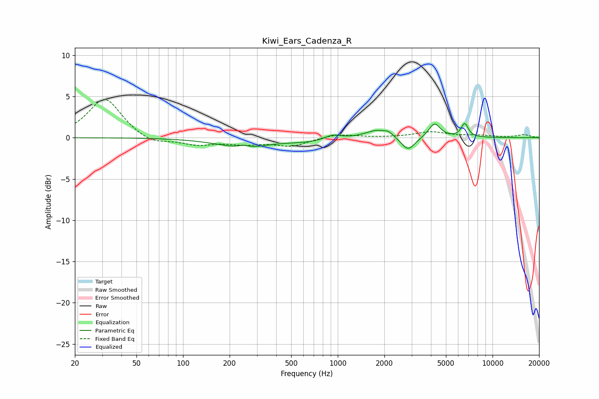

# Kiwi_Ears_Cadenza_R
See [usage instructions](https://github.com/jaakkopasanen/AutoEq#usage) for more options and info.

### Parametric EQs
Apply preamp of -1.8 dB when using parametric equalizer.

|   # | Type    |   Fc (Hz) |    Q |   Gain (dB) |
|-----|---------|-----------|------|-------------|
|   1 | Peaking |       238 | 0.81 |        -1   |
|   2 | Peaking |       246 | 4.23 |         0.4 |
|   3 | Peaking |       261 | 1.71 |        -0.2 |
|   4 | Peaking |       650 | 0.93 |        -0.4 |
|   5 | Peaking |       927 | 2.75 |         0.6 |
|   6 | Peaking |      1788 | 1.9  |         1   |
|   7 | Peaking |      2134 | 4.8  |         0.4 |
|   8 | Peaking |      2845 | 3.14 |        -1.7 |
|   9 | Peaking |      4218 | 3.76 |         1.8 |
|  10 | Peaking |      6612 | 6    |         1.6 |

### Fixed Band EQs
When using fixed band (also called graphic) equalizer, apply preamp of **-4.7 dB** (if available) and set gains manually with these parameters.

|   # | Type    |   Fc (Hz) |    Q |   Gain (dB) |
|-----|---------|-----------|------|-------------|
|   1 | Peaking |        31 | 1.41 |         4.8 |
|   2 | Peaking |        62 | 1.41 |        -0.9 |
|   3 | Peaking |       125 | 1.41 |        -0.8 |
|   4 | Peaking |       250 | 1.41 |        -0.6 |
|   5 | Peaking |       500 | 1.41 |        -1   |
|   6 | Peaking |      1000 | 1.41 |         0.5 |
|   7 | Peaking |      2000 | 1.41 |         0   |
|   8 | Peaking |      4000 | 1.41 |         0.7 |
|   9 | Peaking |      8000 | 1.41 |         0.2 |
|  10 | Peaking |     16000 | 1.41 |         0.3 |

### Graphs

