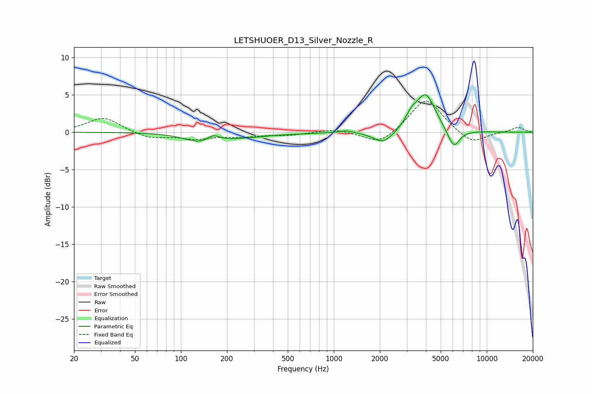

# LETSHUOER_D13_Silver_Nozzle_R
See [usage instructions](https://github.com/jaakkopasanen/AutoEq#usage) for more options and info.

### Parametric EQs
Apply preamp of -5.1 dB when using parametric equalizer.

|   # | Type    |   Fc (Hz) |    Q |   Gain (dB) |
|-----|---------|-----------|------|-------------|
|   1 | Peaking |       134 | 1.4  |        -1.2 |
|   2 | Peaking |       163 | 3.42 |         0.9 |
|   3 | Peaking |       214 | 1.12 |        -0.6 |
|   4 | Peaking |       322 | 2.07 |        -0.2 |
|   5 | Peaking |       520 | 1.11 |        -0.2 |
|   6 | Peaking |      1217 | 2.99 |         0.3 |
|   7 | Peaking |      2109 | 2.14 |        -1.7 |
|   8 | Peaking |      3216 | 3.68 |         1.3 |
|   9 | Peaking |      3989 | 2.19 |         5   |
|  10 | Peaking |      6072 | 3.47 |        -2.6 |

### Fixed Band EQs
When using fixed band (also called graphic) equalizer, apply preamp of **-4.2 dB** (if available) and set gains manually with these parameters.

|   # | Type    |   Fc (Hz) |    Q |   Gain (dB) |
|-----|---------|-----------|------|-------------|
|   1 | Peaking |        31 | 1.41 |         2   |
|   2 | Peaking |        62 | 1.41 |        -0.9 |
|   3 | Peaking |       125 | 1.41 |        -0.8 |
|   4 | Peaking |       250 | 1.41 |        -0.5 |
|   5 | Peaking |       500 | 1.41 |        -0.4 |
|   6 | Peaking |      1000 | 1.41 |         0.5 |
|   7 | Peaking |      2000 | 1.41 |        -1.8 |
|   8 | Peaking |      4000 | 1.41 |         4.7 |
|   9 | Peaking |      8000 | 1.41 |        -1.7 |
|  10 | Peaking |     16000 | 1.41 |         0.7 |

### Graphs

