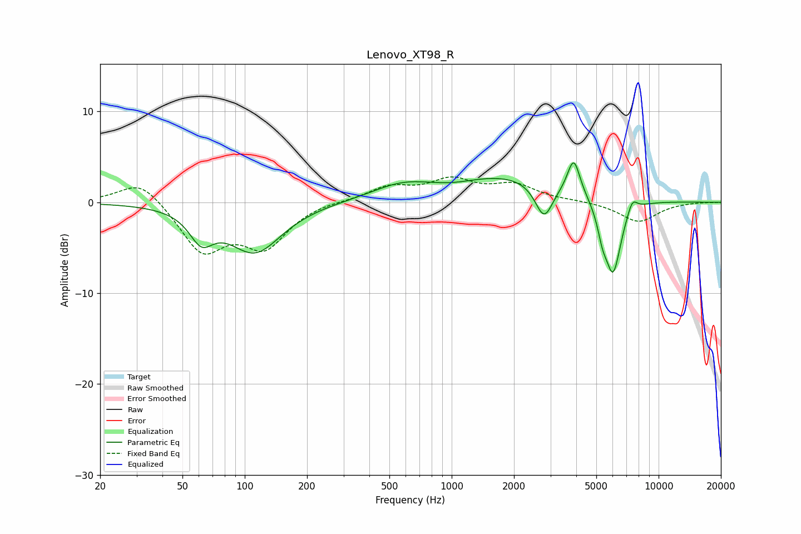

# Lenovo_XT98_R
See [usage instructions](https://github.com/jaakkopasanen/AutoEq#usage) for more options and info.

### Parametric EQs
Apply preamp of -4.5 dB when using parametric equalizer.

|   # | Type    |   Fc (Hz) |    Q |   Gain (dB) |
|-----|---------|-----------|------|-------------|
|   1 | Peaking |        62 | 2.51 |        -3.1 |
|   2 | Peaking |       112 | 1.09 |        -5.4 |
|   3 | Peaking |       573 | 0.96 |         1.5 |
|   4 | Peaking |      1011 | 1.19 |        -0.5 |
|   5 | Peaking |      1830 | 0.47 |         2.9 |
|   6 | Peaking |      2795 | 3.27 |        -3.9 |
|   7 | Peaking |      3890 | 4.62 |         4   |
|   8 | Peaking |      5346 | 6    |        -2   |
|   9 | Peaking |      6021 | 3.42 |        -8.3 |
|  10 | Peaking |      7459 | 5.65 |         1.5 |

### Fixed Band EQs
When using fixed band (also called graphic) equalizer, apply preamp of **-2.9 dB** (if available) and set gains manually with these parameters.

|   # | Type    |   Fc (Hz) |    Q |   Gain (dB) |
|-----|---------|-----------|------|-------------|
|   1 | Peaking |        31 | 1.41 |         2.7 |
|   2 | Peaking |        62 | 1.41 |        -5.3 |
|   3 | Peaking |       125 | 1.41 |        -4.6 |
|   4 | Peaking |       250 | 1.41 |         0.2 |
|   5 | Peaking |       500 | 1.41 |         1.6 |
|   6 | Peaking |      1000 | 1.41 |         2.2 |
|   7 | Peaking |      2000 | 1.41 |         1.8 |
|   8 | Peaking |      4000 | 1.41 |         0.1 |
|   9 | Peaking |      8000 | 1.41 |        -2.2 |
|  10 | Peaking |     16000 | 1.41 |         0   |

### Graphs

