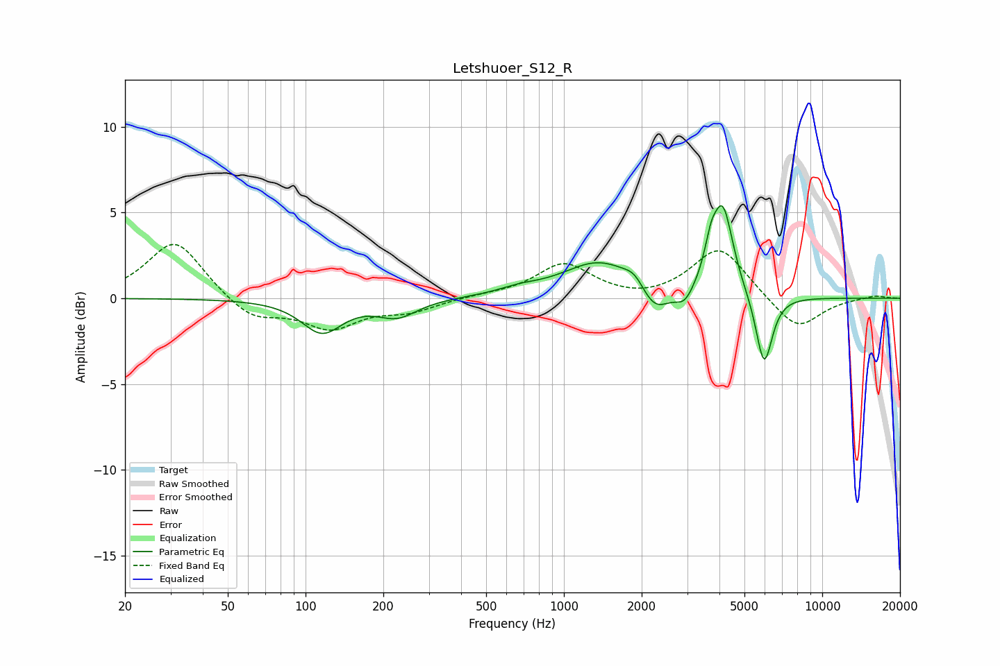

# Letshuoer_S12_R
See [usage instructions](https://github.com/jaakkopasanen/AutoEq#usage) for more options and info.

### Parametric EQs
Apply preamp of -5.5 dB when using parametric equalizer.

|   # | Type    |   Fc (Hz) |    Q |   Gain (dB) |
|-----|---------|-----------|------|-------------|
|   1 | Peaking |       116 | 1.81 |        -1.9 |
|   2 | Peaking |       227 | 1.84 |        -1   |
|   3 | Peaking |       669 | 1.77 |         0.3 |
|   4 | Peaking |      1383 | 0.98 |         2.1 |
|   5 | Peaking |      1881 | 3.6  |         0.7 |
|   6 | Peaking |      2242 | 2.39 |        -1.7 |
|   7 | Peaking |      2933 | 4.06 |        -0.9 |
|   8 | Peaking |      3700 | 6    |         1.5 |
|   9 | Peaking |      4124 | 3.49 |         5.1 |
|  10 | Peaking |      5956 | 4.33 |        -4.2 |

### Fixed Band EQs
When using fixed band (also called graphic) equalizer, apply preamp of **-3.2 dB** (if available) and set gains manually with these parameters.

|   # | Type    |   Fc (Hz) |    Q |   Gain (dB) |
|-----|---------|-----------|------|-------------|
|   1 | Peaking |        31 | 1.41 |         3.4 |
|   2 | Peaking |        62 | 1.41 |        -1.3 |
|   3 | Peaking |       125 | 1.41 |        -1.6 |
|   4 | Peaking |       250 | 1.41 |        -0.7 |
|   5 | Peaking |       500 | 1.41 |         0.1 |
|   6 | Peaking |      1000 | 1.41 |         2   |
|   7 | Peaking |      2000 | 1.41 |        -0.2 |
|   8 | Peaking |      4000 | 1.41 |         3   |
|   9 | Peaking |      8000 | 1.41 |        -1.9 |
|  10 | Peaking |     16000 | 1.41 |         0.2 |

### Graphs

