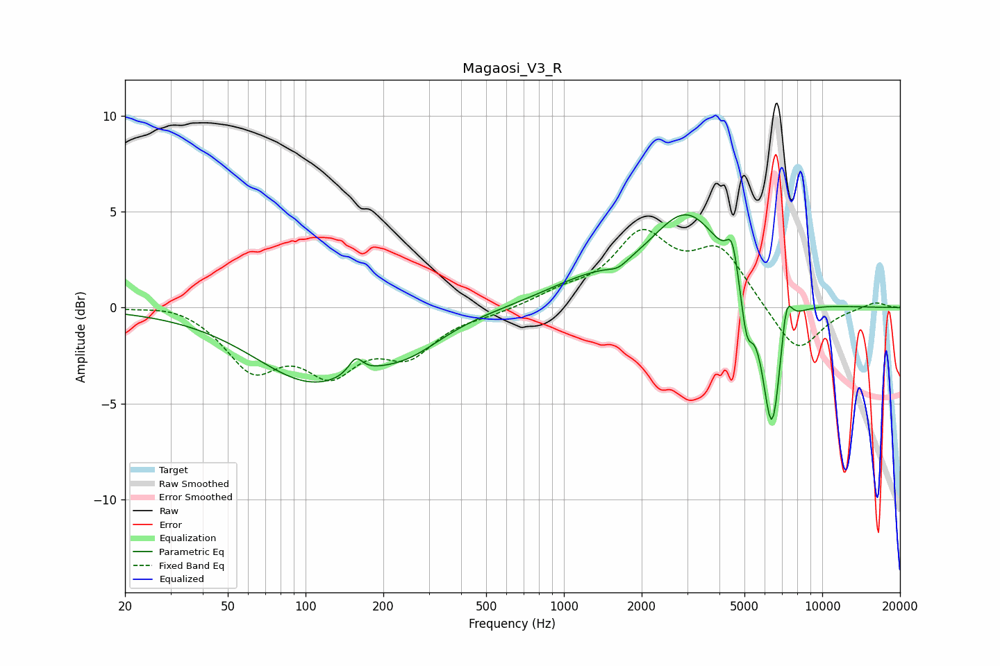

# Magaosi_V3_R
See [usage instructions](https://github.com/jaakkopasanen/AutoEq#usage) for more options and info.

### Parametric EQs
Apply preamp of -4.9 dB when using parametric equalizer.

|   # | Type    |   Fc (Hz) |    Q |   Gain (dB) |
|-----|---------|-----------|------|-------------|
|   1 | Peaking |       106 | 0.62 |        -3.7 |
|   2 | Peaking |       156 | 5.16 |         0.9 |
|   3 | Peaking |       252 | 1.02 |        -1.2 |
|   4 | Peaking |      1194 | 0.82 |         1   |
|   5 | Peaking |      1621 | 3.85 |        -0.3 |
|   6 | Peaking |      3016 | 0.97 |         4.8 |
|   7 | Peaking |      4486 | 6    |         1.9 |
|   8 | Peaking |      5103 | 6    |        -2.4 |
|   9 | Peaking |      6392 | 3.61 |        -7.5 |
|  10 | Peaking |      7254 | 5.94 |         2.4 |

### Fixed Band EQs
When using fixed band (also called graphic) equalizer, apply preamp of **-4.2 dB** (if available) and set gains manually with these parameters.

|   # | Type    |   Fc (Hz) |    Q |   Gain (dB) |
|-----|---------|-----------|------|-------------|
|   1 | Peaking |        31 | 1.41 |         0.3 |
|   2 | Peaking |        62 | 1.41 |        -2.9 |
|   3 | Peaking |       125 | 1.41 |        -2.9 |
|   4 | Peaking |       250 | 1.41 |        -2.2 |
|   5 | Peaking |       500 | 1.41 |        -0.2 |
|   6 | Peaking |      1000 | 1.41 |         0.6 |
|   7 | Peaking |      2000 | 1.41 |         3.6 |
|   8 | Peaking |      4000 | 1.41 |         2.9 |
|   9 | Peaking |      8000 | 1.41 |        -2.5 |
|  10 | Peaking |     16000 | 1.41 |         0.3 |

### Graphs

