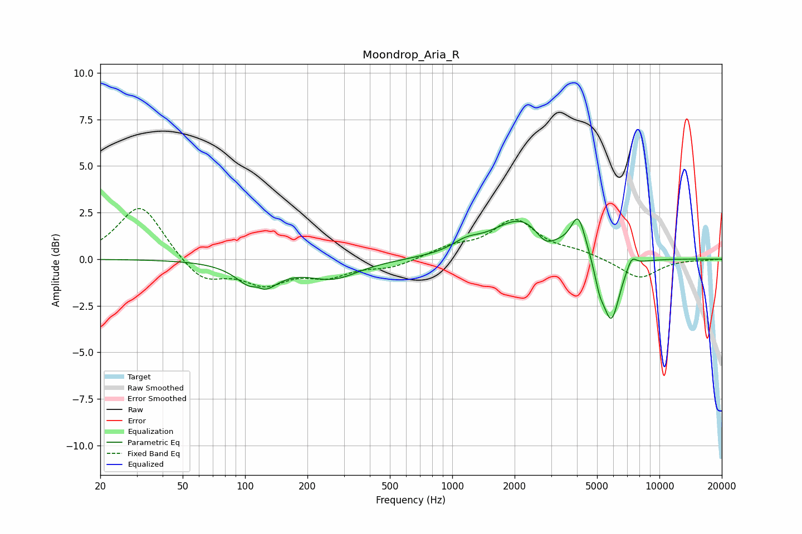

# Moondrop_Aria_R
See [usage instructions](https://github.com/jaakkopasanen/AutoEq#usage) for more options and info.

### Parametric EQs
Apply preamp of -2.3 dB when using parametric equalizer.

|   # | Type    |   Fc (Hz) |    Q |   Gain (dB) |
|-----|---------|-----------|------|-------------|
|   1 | Peaking |       114 | 4.55 |         0.5 |
|   2 | Peaking |       116 | 1.82 |        -1.8 |
|   3 | Peaking |       265 | 1.13 |        -1   |
|   4 | Peaking |      1165 | 2.13 |         0.5 |
|   5 | Peaking |      2183 | 0.99 |         2.2 |
|   6 | Peaking |      2809 | 2.98 |        -0.8 |
|   7 | Peaking |      4060 | 3.98 |         2   |
|   8 | Peaking |      5128 | 6    |        -0.9 |
|   9 | Peaking |      5849 | 3.31 |        -3.5 |
|  10 | Peaking |      7352 | 6    |         0.6 |

### Fixed Band EQs
When using fixed band (also called graphic) equalizer, apply preamp of **-2.8 dB** (if available) and set gains manually with these parameters.

|   # | Type    |   Fc (Hz) |    Q |   Gain (dB) |
|-----|---------|-----------|------|-------------|
|   1 | Peaking |        31 | 1.41 |         3   |
|   2 | Peaking |        62 | 1.41 |        -1.3 |
|   3 | Peaking |       125 | 1.41 |        -1.2 |
|   4 | Peaking |       250 | 1.41 |        -0.8 |
|   5 | Peaking |       500 | 1.41 |        -0.4 |
|   6 | Peaking |      1000 | 1.41 |         0.6 |
|   7 | Peaking |      2000 | 1.41 |         2   |
|   8 | Peaking |      4000 | 1.41 |         0.3 |
|   9 | Peaking |      8000 | 1.41 |        -1.1 |
|  10 | Peaking |     16000 | 1.41 |        -0   |

### Graphs

