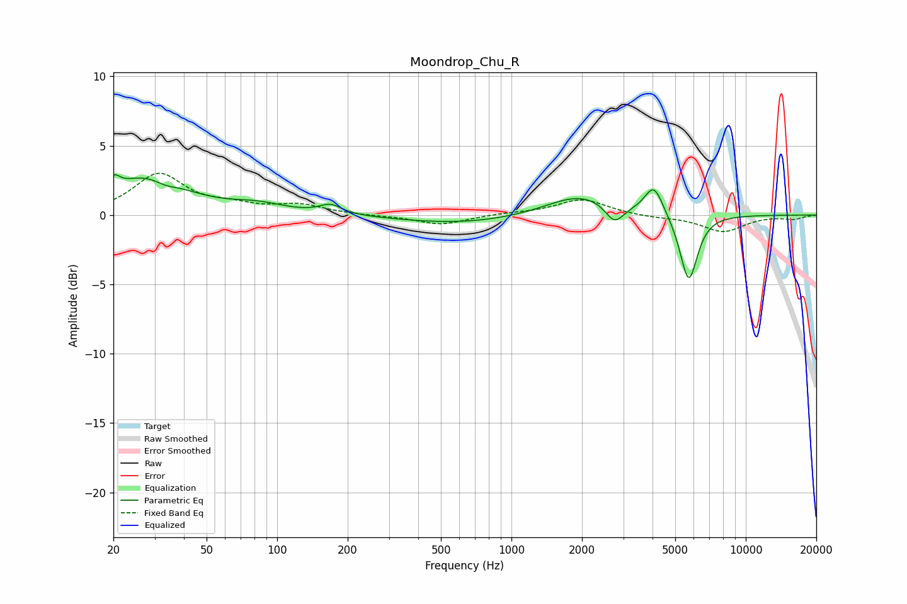

# Moondrop_Chu_R
See [usage instructions](https://github.com/jaakkopasanen/AutoEq#usage) for more options and info.

### Parametric EQs
Apply preamp of -3.0 dB when using parametric equalizer.

|   # | Type    |   Fc (Hz) |    Q |   Gain (dB) |
|-----|---------|-----------|------|-------------|
|   1 | Peaking |        20 | 5.99 |         0.9 |
|   2 | Peaking |        28 | 0.88 |         2.7 |
|   3 | Peaking |        33 | 2.74 |        -0.4 |
|   4 | Peaking |        83 | 1.19 |         0.6 |
|   5 | Peaking |       169 | 3.01 |         0.7 |
|   6 | Peaking |       613 | 0.54 |        -0.6 |
|   7 | Peaking |      1973 | 0.98 |         1.5 |
|   8 | Peaking |      2755 | 3.58 |        -1.4 |
|   9 | Peaking |      4057 | 3.58 |         2.1 |
|  10 | Peaking |      5709 | 3.68 |        -4.9 |

### Fixed Band EQs
When using fixed band (also called graphic) equalizer, apply preamp of **-3.1 dB** (if available) and set gains manually with these parameters.

|   # | Type    |   Fc (Hz) |    Q |   Gain (dB) |
|-----|---------|-----------|------|-------------|
|   1 | Peaking |        31 | 1.41 |         2.9 |
|   2 | Peaking |        62 | 1.41 |         0.5 |
|   3 | Peaking |       125 | 1.41 |         0.7 |
|   4 | Peaking |       250 | 1.41 |        -0   |
|   5 | Peaking |       500 | 1.41 |        -0.7 |
|   6 | Peaking |      1000 | 1.41 |         0.1 |
|   7 | Peaking |      2000 | 1.41 |         1.1 |
|   8 | Peaking |      4000 | 1.41 |        -0.1 |
|   9 | Peaking |      8000 | 1.41 |        -1.2 |
|  10 | Peaking |     16000 | 1.41 |        -0.3 |

### Graphs

