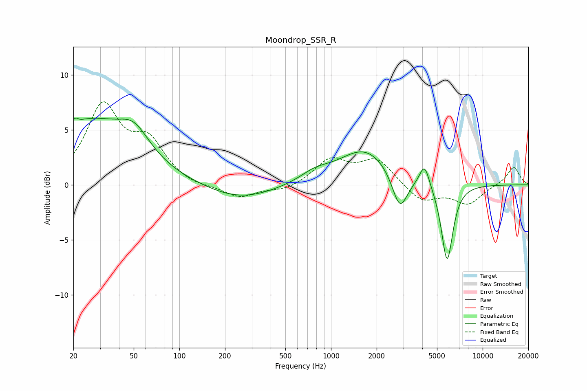

# Moondrop_SSR_R
See [usage instructions](https://github.com/jaakkopasanen/AutoEq#usage) for more options and info.

### Parametric EQs
Apply preamp of -6.2 dB when using parametric equalizer.

|   # | Type    |   Fc (Hz) |    Q |   Gain (dB) |
|-----|---------|-----------|------|-------------|
|   1 | Peaking |        21 | 5.98 |         2.6 |
|   2 | Peaking |        21 | 5.94 |        -2.2 |
|   3 | Peaking |        25 | 0.48 |         5.6 |
|   4 | Peaking |        50 | 1.44 |         2.2 |
|   5 | Peaking |       251 | 0.63 |        -1.4 |
|   6 | Peaking |       783 | 1.45 |         0.8 |
|   7 | Peaking |      1679 | 0.82 |         3.3 |
|   8 | Peaking |      2843 | 2.77 |        -3.4 |
|   9 | Peaking |      4137 | 4.32 |         2.1 |
|  10 | Peaking |      5829 | 3.63 |        -7.1 |

### Fixed Band EQs
When using fixed band (also called graphic) equalizer, apply preamp of **-7.7 dB** (if available) and set gains manually with these parameters.

|   # | Type    |   Fc (Hz) |    Q |   Gain (dB) |
|-----|---------|-----------|------|-------------|
|   1 | Peaking |        31 | 1.41 |         6.9 |
|   2 | Peaking |        62 | 1.41 |         3.5 |
|   3 | Peaking |       125 | 1.41 |        -0.3 |
|   4 | Peaking |       250 | 1.41 |        -1.2 |
|   5 | Peaking |       500 | 1.41 |        -0.5 |
|   6 | Peaking |      1000 | 1.41 |         2.2 |
|   7 | Peaking |      2000 | 1.41 |         2.3 |
|   8 | Peaking |      4000 | 1.41 |        -1.6 |
|   9 | Peaking |      8000 | 1.41 |        -1.7 |
|  10 | Peaking |     16000 | 1.41 |         1.7 |

### Graphs

