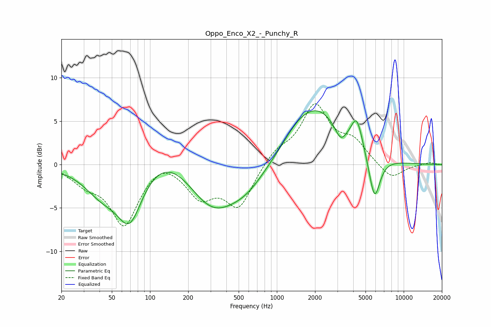

# Oppo_Enco_X2_-_Punchy_R
See [usage instructions](https://github.com/jaakkopasanen/AutoEq#usage) for more options and info.

### Parametric EQs
Apply preamp of -6.3 dB when using parametric equalizer.

|   # | Type    |   Fc (Hz) |    Q |   Gain (dB) |
|-----|---------|-----------|------|-------------|
|   1 | Peaking |        42 | 1    |        -2.9 |
|   2 | Peaking |        69 | 1.41 |        -6.2 |
|   3 | Peaking |       145 | 0.61 |         3.1 |
|   4 | Peaking |       306 | 0.67 |        -5.9 |
|   5 | Peaking |       587 | 0.99 |        -1.7 |
|   6 | Peaking |      1448 | 1.16 |         1.4 |
|   7 | Peaking |      2125 | 0.72 |         5.9 |
|   8 | Peaking |      3180 | 3.23 |        -1.7 |
|   9 | Peaking |      4268 | 3.1  |         3.5 |
|  10 | Peaking |      5884 | 3.12 |        -5.2 |

### Fixed Band EQs
When using fixed band (also called graphic) equalizer, apply preamp of **-7.1 dB** (if available) and set gains manually with these parameters.

|   # | Type    |   Fc (Hz) |    Q |   Gain (dB) |
|-----|---------|-----------|------|-------------|
|   1 | Peaking |        31 | 1.41 |        -1.7 |
|   2 | Peaking |        62 | 1.41 |        -6.8 |
|   3 | Peaking |       125 | 1.41 |         1.1 |
|   4 | Peaking |       250 | 1.41 |        -3.4 |
|   5 | Peaking |       500 | 1.41 |        -4.8 |
|   6 | Peaking |      1000 | 1.41 |         1.5 |
|   7 | Peaking |      2000 | 1.41 |         6.6 |
|   8 | Peaking |      4000 | 1.41 |         2.3 |
|   9 | Peaking |      8000 | 1.41 |        -1.8 |
|  10 | Peaking |     16000 | 1.41 |         0.2 |

### Graphs

