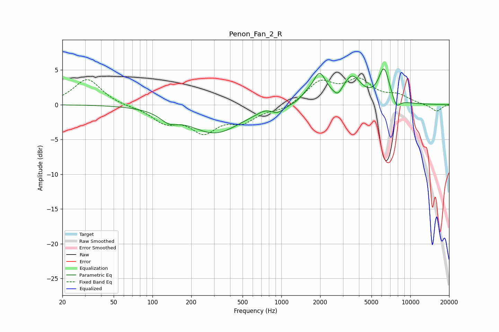

# Penon_Fan_2_R
See [usage instructions](https://github.com/jaakkopasanen/AutoEq#usage) for more options and info.

### Parametric EQs
Apply preamp of -5.2 dB when using parametric equalizer.

|   # | Type    |   Fc (Hz) |    Q |   Gain (dB) |
|-----|---------|-----------|------|-------------|
|   1 | Peaking |       134 | 2.01 |        -1.3 |
|   2 | Peaking |       305 | 0.71 |        -4   |
|   3 | Peaking |       736 | 2.97 |         0.4 |
|   4 | Peaking |       938 | 3.33 |        -0.7 |
|   5 | Peaking |      1561 | 3.44 |         0.7 |
|   6 | Peaking |      1975 | 2.73 |         4   |
|   7 | Peaking |      2740 | 4.41 |        -1.1 |
|   8 | Peaking |      3531 | 1.97 |         3.7 |
|   9 | Peaking |      6252 | 3.23 |         4.8 |
|  10 | Peaking |      7808 | 4.52 |        -1.5 |

### Fixed Band EQs
When using fixed band (also called graphic) equalizer, apply preamp of **-3.9 dB** (if available) and set gains manually with these parameters.

|   # | Type    |   Fc (Hz) |    Q |   Gain (dB) |
|-----|---------|-----------|------|-------------|
|   1 | Peaking |        31 | 1.41 |         3.7 |
|   2 | Peaking |        62 | 1.41 |        -0.2 |
|   3 | Peaking |       125 | 1.41 |        -2.3 |
|   4 | Peaking |       250 | 1.41 |        -3.6 |
|   5 | Peaking |       500 | 1.41 |        -2.1 |
|   6 | Peaking |      1000 | 1.41 |        -0.7 |
|   7 | Peaking |      2000 | 1.41 |         3.1 |
|   8 | Peaking |      4000 | 1.41 |         3.2 |
|   9 | Peaking |      8000 | 1.41 |         1.1 |
|  10 | Peaking |     16000 | 1.41 |        -1   |

### Graphs

