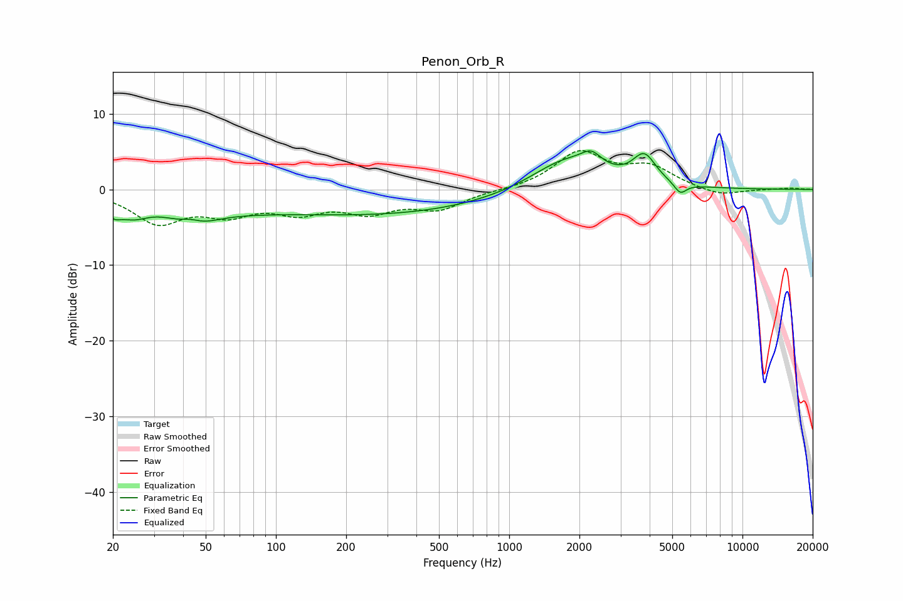

# Penon_Orb_R
See [usage instructions](https://github.com/jaakkopasanen/AutoEq#usage) for more options and info.

### Parametric EQs
Apply preamp of -5.2 dB when using parametric equalizer.

|   # | Type    |   Fc (Hz) |    Q |   Gain (dB) |
|-----|---------|-----------|------|-------------|
|   1 | Peaking |        20 | 4.8  |        -1.4 |
|   2 | Peaking |        24 | 1.91 |        -2.4 |
|   3 | Peaking |        43 | 2.72 |         1.4 |
|   4 | Peaking |        43 | 1.43 |        -3.6 |
|   5 | Peaking |        71 | 0.79 |        -0.7 |
|   6 | Peaking |       263 | 0.27 |        -3.3 |
|   7 | Peaking |      1755 | 0.93 |         4.3 |
|   8 | Peaking |      2252 | 3.28 |         1.8 |
|   9 | Peaking |      3796 | 2.85 |         3.7 |
|  10 | Peaking |      5410 | 5.3  |        -1.5 |

### Fixed Band EQs
When using fixed band (also called graphic) equalizer, apply preamp of **-5.2 dB** (if available) and set gains manually with these parameters.

|   # | Type    |   Fc (Hz) |    Q |   Gain (dB) |
|-----|---------|-----------|------|-------------|
|   1 | Peaking |        31 | 1.41 |        -4.2 |
|   2 | Peaking |        62 | 1.41 |        -2.7 |
|   3 | Peaking |       125 | 1.41 |        -2.5 |
|   4 | Peaking |       250 | 1.41 |        -2.6 |
|   5 | Peaking |       500 | 1.41 |        -2.4 |
|   6 | Peaking |      1000 | 1.41 |        -0.1 |
|   7 | Peaking |      2000 | 1.41 |         4.8 |
|   8 | Peaking |      4000 | 1.41 |         2.7 |
|   9 | Peaking |      8000 | 1.41 |        -1   |
|  10 | Peaking |     16000 | 1.41 |         0.2 |

### Graphs

