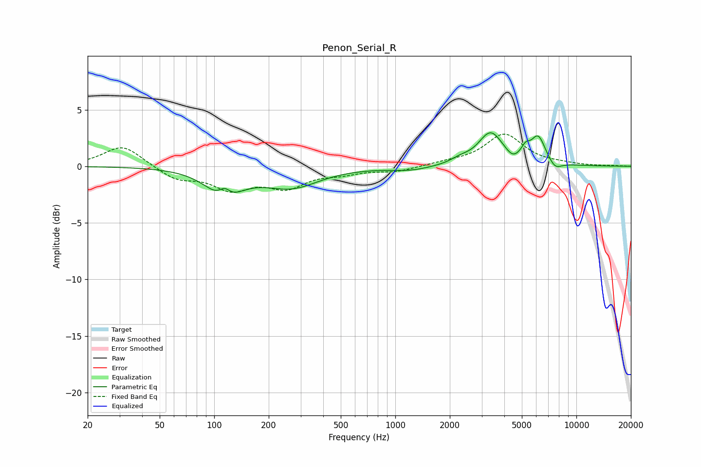

# Penon_Serial_R
See [usage instructions](https://github.com/jaakkopasanen/AutoEq#usage) for more options and info.

### Parametric EQs
Apply preamp of -3.1 dB when using parametric equalizer.

|   # | Type    |   Fc (Hz) |    Q |   Gain (dB) |
|-----|---------|-----------|------|-------------|
|   1 | Peaking |       113 | 1.52 |        -2.5 |
|   2 | Peaking |       114 | 4.37 |         1   |
|   3 | Peaking |       267 | 0.92 |        -1.7 |
|   4 | Peaking |      1210 | 1.27 |        -0.4 |
|   5 | Peaking |      2278 | 2.75 |         0.4 |
|   6 | Peaking |      3361 | 2.08 |         2.9 |
|   7 | Peaking |      4433 | 4.34 |        -0.5 |
|   8 | Peaking |      5243 | 5.99 |         0.8 |
|   9 | Peaking |      6153 | 3.37 |         2.4 |
|  10 | Peaking |      7632 | 3.81 |        -0.7 |

### Fixed Band EQs
When using fixed band (also called graphic) equalizer, apply preamp of **-2.9 dB** (if available) and set gains manually with these parameters.

|   # | Type    |   Fc (Hz) |    Q |   Gain (dB) |
|-----|---------|-----------|------|-------------|
|   1 | Peaking |        31 | 1.41 |         1.9 |
|   2 | Peaking |        62 | 1.41 |        -1.1 |
|   3 | Peaking |       125 | 1.41 |        -1.8 |
|   4 | Peaking |       250 | 1.41 |        -1.7 |
|   5 | Peaking |       500 | 1.41 |        -0.5 |
|   6 | Peaking |      1000 | 1.41 |        -0.4 |
|   7 | Peaking |      2000 | 1.41 |         0.3 |
|   8 | Peaking |      4000 | 1.41 |         2.8 |
|   9 | Peaking |      8000 | 1.41 |         0.1 |
|  10 | Peaking |     16000 | 1.41 |         0   |

### Graphs

