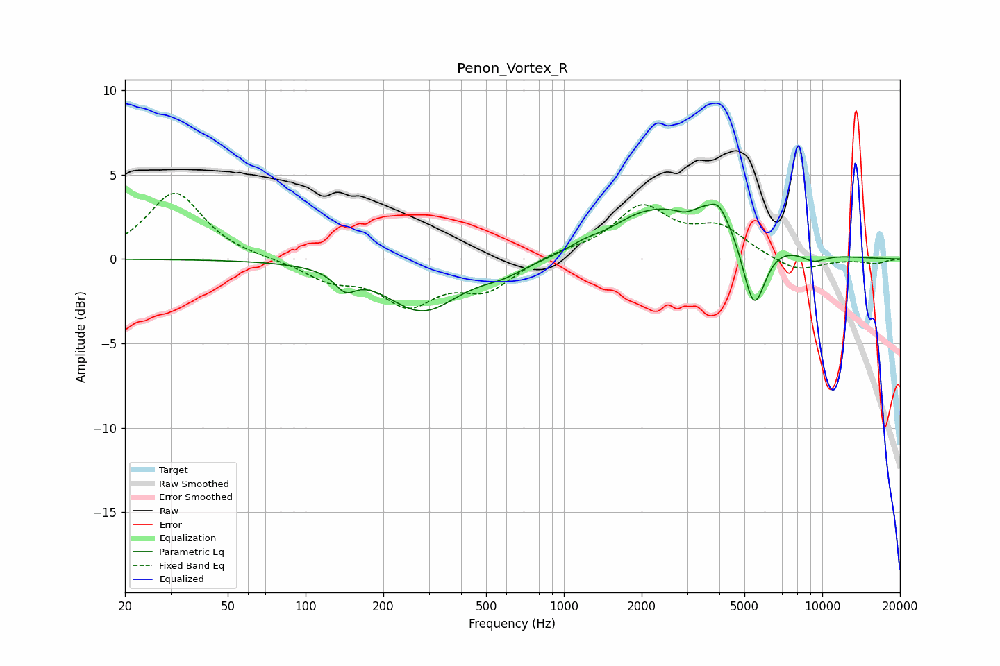

# Penon_Vortex_R
See [usage instructions](https://github.com/jaakkopasanen/AutoEq#usage) for more options and info.

### Parametric EQs
Apply preamp of -3.3 dB when using parametric equalizer.

|   # | Type    |   Fc (Hz) |    Q |   Gain (dB) |
|-----|---------|-----------|------|-------------|
|   1 | Peaking |       142 | 3.54 |        -1   |
|   2 | Peaking |       283 | 0.99 |        -3   |
|   3 | Peaking |       581 | 1.64 |        -0.6 |
|   4 | Peaking |      1200 | 2.38 |         0.3 |
|   5 | Peaking |      1939 | 1.17 |         1.3 |
|   6 | Peaking |      2976 | 3.13 |        -0.6 |
|   7 | Peaking |      3620 | 0.77 |         3.3 |
|   8 | Peaking |      3974 | 4.68 |         0.7 |
|   9 | Peaking |      5435 | 2.99 |        -4.8 |
|  10 | Peaking |      9246 | 2.53 |        -0.6 |

### Fixed Band EQs
When using fixed band (also called graphic) equalizer, apply preamp of **-4.0 dB** (if available) and set gains manually with these parameters.

|   # | Type    |   Fc (Hz) |    Q |   Gain (dB) |
|-----|---------|-----------|------|-------------|
|   1 | Peaking |        31 | 1.41 |         4   |
|   2 | Peaking |        62 | 1.41 |         0   |
|   3 | Peaking |       125 | 1.41 |        -1.1 |
|   4 | Peaking |       250 | 1.41 |        -2.5 |
|   5 | Peaking |       500 | 1.41 |        -1.7 |
|   6 | Peaking |      1000 | 1.41 |         0.4 |
|   7 | Peaking |      2000 | 1.41 |         3   |
|   8 | Peaking |      4000 | 1.41 |         1.7 |
|   9 | Peaking |      8000 | 1.41 |        -0.8 |
|  10 | Peaking |     16000 | 1.41 |        -0.3 |

### Graphs

