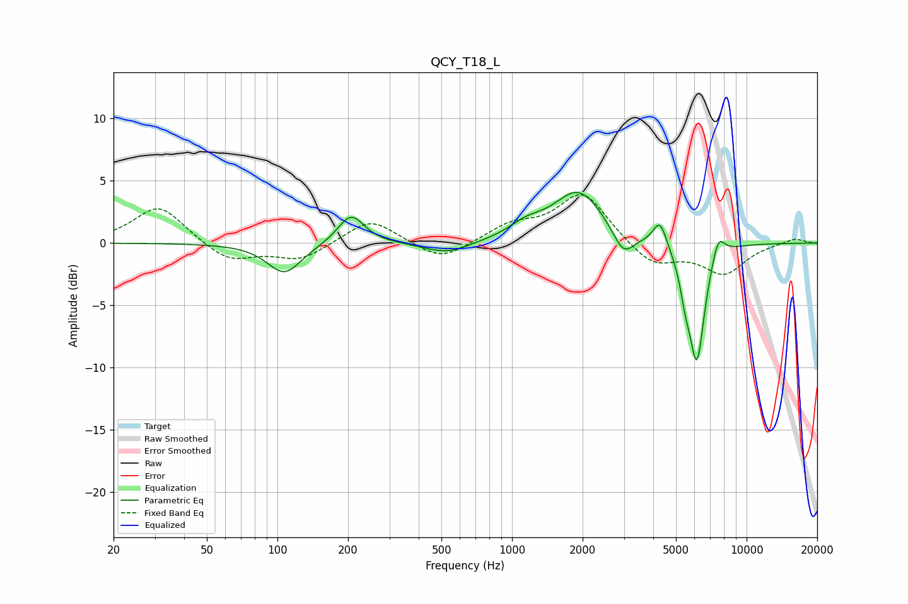

# QCY_T18_L
See [usage instructions](https://github.com/jaakkopasanen/AutoEq#usage) for more options and info.

### Parametric EQs
Apply preamp of -4.2 dB when using parametric equalizer.

|   # | Type    |   Fc (Hz) |    Q |   Gain (dB) |
|-----|---------|-----------|------|-------------|
|   1 | Peaking |       107 | 1.94 |        -2.5 |
|   2 | Peaking |       206 | 2.5  |         2.4 |
|   3 | Peaking |       529 | 1.48 |        -0.9 |
|   4 | Peaking |      1148 | 1.93 |         1   |
|   5 | Peaking |      1922 | 1.32 |         4.2 |
|   6 | Peaking |      2985 | 3.15 |        -2   |
|   7 | Peaking |      4271 | 4.82 |         2.1 |
|   8 | Peaking |      5485 | 5.99 |        -1.9 |
|   9 | Peaking |      6139 | 4.05 |        -9.4 |
|  10 | Peaking |      7575 | 4.94 |         1.9 |

### Fixed Band EQs
When using fixed band (also called graphic) equalizer, apply preamp of **-4.0 dB** (if available) and set gains manually with these parameters.

|   # | Type    |   Fc (Hz) |    Q |   Gain (dB) |
|-----|---------|-----------|------|-------------|
|   1 | Peaking |        31 | 1.41 |         3   |
|   2 | Peaking |        62 | 1.41 |        -1.5 |
|   3 | Peaking |       125 | 1.41 |        -1.4 |
|   4 | Peaking |       250 | 1.41 |         2   |
|   5 | Peaking |       500 | 1.41 |        -1.5 |
|   6 | Peaking |      1000 | 1.41 |         1.3 |
|   7 | Peaking |      2000 | 1.41 |         4   |
|   8 | Peaking |      4000 | 1.41 |        -1.9 |
|   9 | Peaking |      8000 | 1.41 |        -2.4 |
|  10 | Peaking |     16000 | 1.41 |         0.4 |

### Graphs

