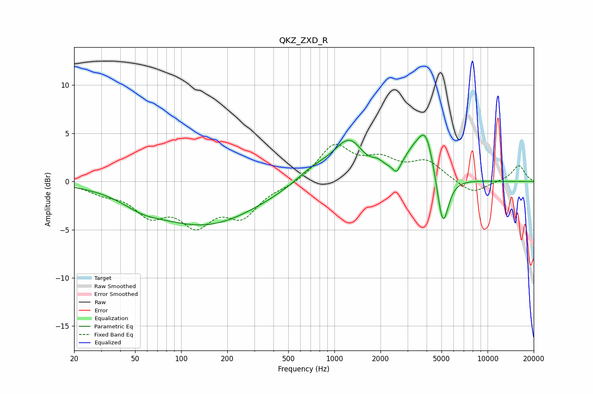

# QKZ_ZXD_R
See [usage instructions](https://github.com/jaakkopasanen/AutoEq#usage) for more options and info.

### Parametric EQs
Apply preamp of -4.9 dB when using parametric equalizer.

|   # | Type    |   Fc (Hz) |    Q |   Gain (dB) |
|-----|---------|-----------|------|-------------|
|   1 | Peaking |        56 | 1.18 |        -0.9 |
|   2 | Peaking |       142 | 0.4  |        -4.4 |
|   3 | Peaking |       719 | 1.22 |         1.3 |
|   4 | Peaking |      1270 | 1.31 |         4.4 |
|   5 | Peaking |      1570 | 2.01 |        -0.7 |
|   6 | Peaking |      1919 | 4.2  |         0.5 |
|   7 | Peaking |      2548 | 6    |        -1   |
|   8 | Peaking |      3224 | 2.34 |         1.6 |
|   9 | Peaking |      3945 | 2.51 |         4.7 |
|  10 | Peaking |      5099 | 3.67 |        -5.8 |

### Fixed Band EQs
When using fixed band (also called graphic) equalizer, apply preamp of **-4.0 dB** (if available) and set gains manually with these parameters.

|   # | Type    |   Fc (Hz) |    Q |   Gain (dB) |
|-----|---------|-----------|------|-------------|
|   1 | Peaking |        31 | 1.41 |        -0.9 |
|   2 | Peaking |        62 | 1.41 |        -3   |
|   3 | Peaking |       125 | 1.41 |        -3.9 |
|   4 | Peaking |       250 | 1.41 |        -3.2 |
|   5 | Peaking |       500 | 1.41 |        -0.4 |
|   6 | Peaking |      1000 | 1.41 |         3.7 |
|   7 | Peaking |      2000 | 1.41 |         1.9 |
|   8 | Peaking |      4000 | 1.41 |         2   |
|   9 | Peaking |      8000 | 1.41 |        -1.4 |
|  10 | Peaking |     16000 | 1.41 |         1.7 |

### Graphs

