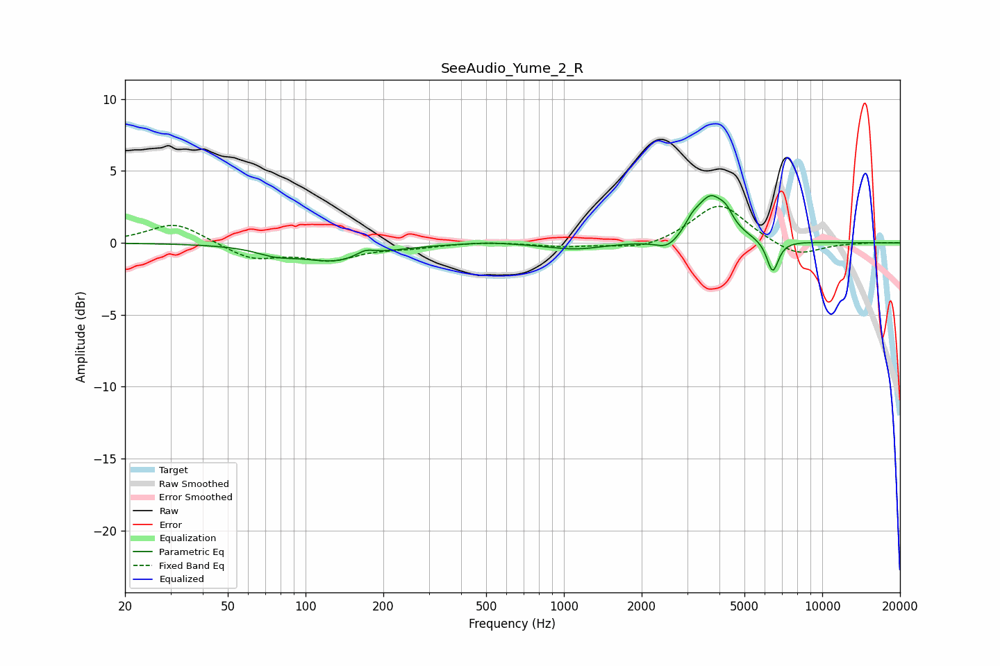

# SeeAudio_Yume_2_R
See [usage instructions](https://github.com/jaakkopasanen/AutoEq#usage) for more options and info.

### Parametric EQs
Apply preamp of -3.4 dB when using parametric equalizer.

|   # | Type    |   Fc (Hz) |    Q |   Gain (dB) |
|-----|---------|-----------|------|-------------|
|   1 | Peaking |        76 | 1.92 |        -0.5 |
|   2 | Peaking |       132 | 1    |        -1.2 |
|   3 | Peaking |       170 | 3.74 |         0.5 |
|   4 | Peaking |       504 | 1.54 |         0.1 |
|   5 | Peaking |      1108 | 1.29 |        -0.5 |
|   6 | Peaking |      2529 | 2.99 |        -0.8 |
|   7 | Peaking |      3135 | 5.48 |         0.5 |
|   8 | Peaking |      3705 | 2.34 |         3.2 |
|   9 | Peaking |      4259 | 6    |         0.6 |
|  10 | Peaking |      6428 | 6    |        -2.2 |

### Fixed Band EQs
When using fixed band (also called graphic) equalizer, apply preamp of **-2.6 dB** (if available) and set gains manually with these parameters.

|   # | Type    |   Fc (Hz) |    Q |   Gain (dB) |
|-----|---------|-----------|------|-------------|
|   1 | Peaking |        31 | 1.41 |         1.4 |
|   2 | Peaking |        62 | 1.41 |        -1.1 |
|   3 | Peaking |       125 | 1.41 |        -1.1 |
|   4 | Peaking |       250 | 1.41 |        -0.3 |
|   5 | Peaking |       500 | 1.41 |         0.1 |
|   6 | Peaking |      1000 | 1.41 |        -0.3 |
|   7 | Peaking |      2000 | 1.41 |        -0.5 |
|   8 | Peaking |      4000 | 1.41 |         2.8 |
|   9 | Peaking |      8000 | 1.41 |        -1   |
|  10 | Peaking |     16000 | 1.41 |         0   |

### Graphs

